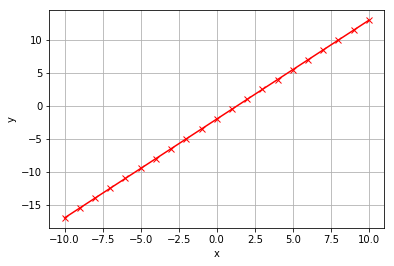
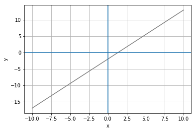
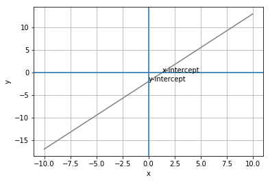
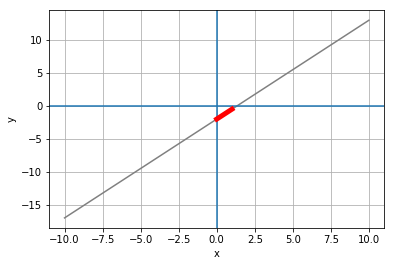
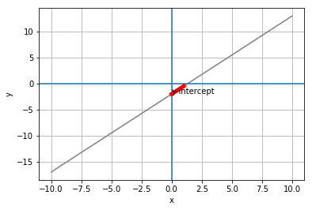

# Linear Equations
The equations in the previous lab included one variable, for which you solved the equation to find its value. Now let's look at equations with multiple variables. For reasons that will become apparent, equations with two variables are known as linear equations.

## Solving a Linear Equation
Consider the following equation:

\begin{equation}2y + 3 = 3x - 1 \end{equation}

This equation includes two different variables, **x** and **y**. These variables depend on one another; the value of x is determined in part by the value of y and vice-versa; so we can't solve the equation and find absolute values for both x and y. However, we *can* solve the equation for one of the variables and obtain a result that describes a relative relationship between the variables.

For example, let's solve this equation for y. First, we'll get rid of the constant on the right by adding 1 to both sides:

\begin{equation}2y + 4 = 3x \end{equation}

Then we'll use the same technique to move the constant on the left to the right to isolate the y term by subtracting 4 from both sides:

\begin{equation}2y = 3x - 4 \end{equation}

Now we can deal with the coefficient for y by dividing both sides by 2:

\begin{equation}y = \frac{3x - 4}{2} \end{equation}

Our equation is now solved. We've isolated **y** and defined it as <sup>3x-4</sup>/<sub>2</sub>

While we can't express **y** as a particular value, we can calculate it for any value of **x**. For example, if **x** has a value of 6, then **y** can be calculated as:

\begin{equation}y = \frac{3\cdot6 - 4}{2} \end{equation}

This gives the result <sup>14</sup>/<sub>2</sub> which can be simplified to 7.

You can view the values of **y** for a range of **x** values by applying the equation to them using the following Python code:


```python
import pandas as pd

# Create a dataframe with an x column containing values from -10 to 10
df = pd.DataFrame ({'x': range(-10, 11)})

# Add a y column by applying the solved equation to x
df['y'] = (3*df['x'] - 4) / 2

#Display the dataframe
df
```


<div>
<style scoped>
    .dataframe tbody tr th:only-of-type {
        vertical-align: middle;
    }

    .dataframe tbody tr th {
        vertical-align: top;
    }

    .dataframe thead th {
        text-align: right;
    }
</style>
<table border="1" class="dataframe">
  <thead>
    <tr style="text-align: right;">
      <th></th>
      <th>x</th>
      <th>y</th>
    </tr>
  </thead>
  <tbody>
    <tr>
      <th>0</th>
      <td>-10</td>
      <td>-17.0</td>
    </tr>
    <tr>
      <th>1</th>
      <td>-9</td>
      <td>-15.5</td>
    </tr>
    <tr>
      <th>2</th>
      <td>-8</td>
      <td>-14.0</td>
    </tr>
    <tr>
      <th>3</th>
      <td>-7</td>
      <td>-12.5</td>
    </tr>
    <tr>
      <th>4</th>
      <td>-6</td>
      <td>-11.0</td>
    </tr>
    <tr>
      <th>5</th>
      <td>-5</td>
      <td>-9.5</td>
    </tr>
    <tr>
      <th>6</th>
      <td>-4</td>
      <td>-8.0</td>
    </tr>
    <tr>
      <th>7</th>
      <td>-3</td>
      <td>-6.5</td>
    </tr>
    <tr>
      <th>8</th>
      <td>-2</td>
      <td>-5.0</td>
    </tr>
    <tr>
      <th>9</th>
      <td>-1</td>
      <td>-3.5</td>
    </tr>
    <tr>
      <th>10</th>
      <td>0</td>
      <td>-2.0</td>
    </tr>
    <tr>
      <th>11</th>
      <td>1</td>
      <td>-0.5</td>
    </tr>
    <tr>
      <th>12</th>
      <td>2</td>
      <td>1.0</td>
    </tr>
    <tr>
      <th>13</th>
      <td>3</td>
      <td>2.5</td>
    </tr>
    <tr>
      <th>14</th>
      <td>4</td>
      <td>4.0</td>
    </tr>
    <tr>
      <th>15</th>
      <td>5</td>
      <td>5.5</td>
    </tr>
    <tr>
      <th>16</th>
      <td>6</td>
      <td>7.0</td>
    </tr>
    <tr>
      <th>17</th>
      <td>7</td>
      <td>8.5</td>
    </tr>
    <tr>
      <th>18</th>
      <td>8</td>
      <td>10.0</td>
    </tr>
    <tr>
      <th>19</th>
      <td>9</td>
      <td>11.5</td>
    </tr>
    <tr>
      <th>20</th>
      <td>10</td>
      <td>13.0</td>
    </tr>
  </tbody>
</table>
</div>


We can also plot these values to visualize the relationship between x and y as a line. For this reason, equations that describe a relative relationship between two variables are known as *linear equations*:


```python
%matplotlib inline
from matplotlib import pyplot as plt

plt.plot(df.x, df.y, color="red", marker = "x")
plt.xlabel('x')
plt.ylabel('y')
plt.grid()
plt.show()
```





In a linear equation, a valid solution is described by an ordered pair of x and y values. For example, valid solutions to the linear equation above include:
- (-10, -17)
- (0, -2)
- (9, 11.5)

The cool thing about linear equations is that we can plot the points for some specific ordered pair solutions to create the line, and then interpolate the x value for any y value (or vice-versa) along the line.

## Intercepts
When we use a linear equation to plot a line, we can easily see where the line intersects the X and Y axes of the plot. These points are known as *intercepts*. The *x-intercept* is where the line intersects the X (horizontal) axis, and the *y-intercept* is where the line intersects the Y (horizontal) axis.

Let's take a look at the line from our linear equation with the X and Y axis shown through the origin (0,0).


```python
plt.plot(df.x, df.y, color="grey")
plt.xlabel('x')
plt.ylabel('y')
plt.grid()

## add axis lines for 0,0
plt.axhline()
plt.axvline()
plt.show()
```





The x-intercept is the point where the line crosses the X axis, and at this point, the **y** value is always 0. Similarly, the y-intercept is where the line crosses the Y axis, at which point the **x** value is 0. So to find the intercepts, we need to solve the equation for **x** when **y** is 0.

For the x-intercept, our equation looks like this:

\begin{equation}0 = \frac{3x - 4}{2} \end{equation}

Which can be reversed to make it look more familar with the x expression on the left:

\begin{equation}\frac{3x - 4}{2} = 0 \end{equation}

We can multiply both sides by 2 to get rid of the fraction:

\begin{equation}3x - 4 = 0 \end{equation}

Then we can add 4 to both sides to get rid of the constant on the left:

\begin{equation}3x = 4 \end{equation}

And finally we can divide both sides by 3 to get the value for x:

\begin{equation}x = \frac{4}{3} \end{equation}

Which simplifies to:

\begin{equation}x = 1\frac{1}{3} \end{equation}

So the x-intercept is 1<sup>1</sup>/<sub>3</sub> (approximately 1.333).

To get the y-intercept, we solve the equation for y when x is 0:

\begin{equation}y = \frac{3\cdot0 - 4}{2} \end{equation}

Since 3 x 0 is 0, this can be simplified to:

\begin{equation}y = \frac{-4}{2} \end{equation}

-4 divided by 2 is -2, so:

\begin{equation}y = -2 \end{equation}

This gives us our y-intercept, so we can plot both intercepts on the graph:


```python
plt.plot(df.x, df.y, color="grey")
plt.xlabel('x')
plt.ylabel('y')
plt.grid()

## add axis lines for 0,0
plt.axhline()
plt.axvline()
plt.annotate('x-intercept',(1.333, 0))
plt.annotate('y-intercept',(0,-2))
plt.show()
```





The ability to calculate the intercepts for a linear equation is useful, because you can calculate only these two points and then draw a straight line through them to create the entire line for the equation.

## Slope
It's clear from the graph that the line from our linear equation describes a slope in which values increase as we travel up and to the right along the line. It can be useful to quantify the slope in terms of how much **x** increases (or decreases) for a given change in **y**. In the notation for this, we use the greek letter &Delta; (*delta*) to represent change:

\begin{equation}slope = \frac{\Delta{y}}{\Delta{x}} \end{equation}

Sometimes slope is represented by the variable ***m***, and the equation is written as:

\begin{equation}m = \frac{y_{2} - y_{1}}{x_{2} - x_{1}} \end{equation}

Although this form of the equation is a little more verbose, it gives us a clue as to how we calculate slope. What we need is any two ordered pairs of x,y values for the line - for example, we know that our line passes through the following two points:
- (0,-2)
- (6,7)

We can take the x and y values from the first pair, and label them x<sub>1</sub> and y<sub>1</sub>; and then take the x and y values from the second point and label them x<sub>2</sub> and y<sub>2</sub>. Then we can plug those into our slope equation:

\begin{equation}m = \frac{7 - -2}{6 - 0} \end{equation}

This is the same as:

\begin{equation}m = \frac{7 + 2}{6 - 0} \end{equation}

That gives us the result <sup>9</sup>/<sub>6</sub> which is 1<sup>1</sup>/<sub>2</sub> or 1.5 .

So what does that actually mean? Well, it tells us that for every change of **1** in x, **y** changes by 1<sup>1</sup>/<sub>2</sub> or 1.5. So if we start from any point on the line and move one unit to the right (along the X axis), we'll need to move 1.5 units up (along the Y axis) to get back to the line.

You can plot the slope onto the original line with the following Python code to verify it fits:


```python
plt.plot(df.x, df.y, color="grey")
plt.xlabel('x')
plt.ylabel('y')
plt.grid()
plt.axhline()
plt.axvline()

# set the slope
m = 1.5

# get the y-intercept
yInt = -2

# plot the slope from the y-intercept for 1x
mx = [0, 1]
my = [yInt, yInt + m]
plt.plot(mx,my, color='red', lw=5)

plt.show()
```





### Slope-Intercept Form
One of the great things about algebraic expressions is that you can write the same equation in multiple ways, or *forms*. The *slope-intercept form* is a specific way of writing a 2-variable linear equation so that the equation definition includes the slope and y-intercept. The generalised slope-intercept form looks like this:

\begin{equation}y = mx + b \end{equation}

In this notation, ***m*** is the slope and ***b*** is the y-intercept.

For example, let's look at the solved linear equation we've been working with so far in this section:

\begin{equation}y = \frac{3x - 4}{2} \end{equation}

Now that we know the slope and y-intercept for the line that this equation defines, we can rewrite the equation as:

\begin{equation}y = 1\frac{1}{2}x + -2 \end{equation}

You can see intuitively that this is true. In our original form of the equation, to find y we multiply x by three, subtract 4, and divide by two - in other words, x is half of 3x - 4; which is 1.5x - 2. So these equations are equivalent, but the slope-intercept form has the advantages of being simpler, and including two key pieces of information we need to plot the line represented by the equation. We know the y-intecept that the line passes through (0, -2), and we know the slope of the line (for every x, we add 1.5 to y.

Let's recreate our set of test x and y values using the slope-intercept form of the equation, and plot them to prove that this  describes the same line:


```python
%matplotlib inline

import pandas as pd
from matplotlib import pyplot as plt

# Create a dataframe with an x column containing values from -10 to 10
df = pd.DataFrame ({'x': range(-10, 11)})

# Define slope and y-intercept
m = 1.5
yInt = -2

# Add a y column by applying the slope-intercept equation to x
df['y'] = m*df['x'] + yInt

# Plot the line
from matplotlib import pyplot as plt

plt.plot(df.x, df.y, color="grey")
plt.xlabel('x')
plt.ylabel('y')
plt.grid()
plt.axhline()
plt.axvline()

# label the y-intercept
plt.annotate('y-intercept',(0,yInt))

# plot the slope from the y-intercept for 1x
mx = [0, 1]
my = [yInt, yInt + m]
plt.plot(mx,my, color='red', lw=5)

plt.show()
```




