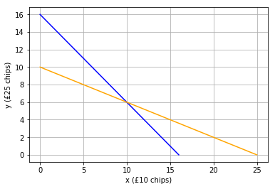
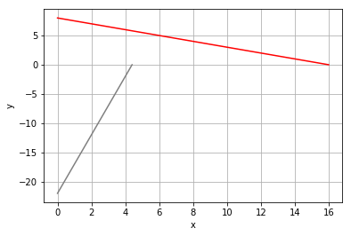

# Systems of Equations
Imagine you are at a casino, and you have a mixture of £10 and £25 chips. You know that you have a total of 16 chips, and you also know that the total value of chips you have is £250. Is this enough information to determine how many of each denomination of chip you have?

Well, we can express each of the facts that we have as an equation. The first equation deals with the total number of chips - we know that this is 16, and that it is the number of £10 chips (which we'll call ***x*** ) added to the number of £25 chips (***y***).

The second equation deals with the total value of the chips (£250), and we know that this is made up of ***x*** chips worth £10 and ***y*** chips worth £25.

Here are the equations

\begin{equation}x + y = 16 \end{equation}
\begin{equation}10x + 25y = 250 \end{equation}

Taken together, these equations form a *system of equations* that will enable us to determine how many of each chip denomination we have.

## Graphing Lines to Find the Intersection Point
One approach is to determine all possible values for x and y in each equation and plot them.

A collection of 16 chips could be made up of 16 £10 chips and no £25 chips, no £10 chips and 16 £25 chips, or any combination between these.

Similarly, a total of £250 could be made up of 25 £10 chips and no £25 chips, no £10 chips and 10 £25 chips, or a combination in between.

Let's plot each of these ranges of values as lines on a graph:


```python
%matplotlib inline
from matplotlib import pyplot as plt

# Get the extremes for number of chips
chipsAll10s = [16, 0]
chipsAll25s = [0, 16]

# Get the extremes for values
valueAll10s = [25,0]
valueAll25s = [0,10]

# Plot the lines
plt.plot(chipsAll10s,chipsAll25s, color='blue')
plt.plot(valueAll10s, valueAll25s, color="orange")
plt.xlabel('x (£10 chips)')
plt.ylabel('y (£25 chips)')
plt.grid()

plt.show()
```





Looking at the graph, you can see that there is only a single combination of £10 and £25 chips that is on both the line for all possible combinations of 16 chips and the line for all possible combinations of £250. The point where the line intersects is (10, 6); or put another way, there are ten £10 chips and six £25 chips.

### Solving a System of Equations with Elimination
You can also solve a system of equations mathematically. Let's take a look at our two equations:

\begin{equation}x + y = 16 \end{equation}
\begin{equation}10x + 25y = 250 \end{equation}

We can combine these equations to eliminate one of the variable terms and solve the resulting equation to find the value of one of the variables. Let's start by combining the equations and eliminating the x term.

We can combine the equations by adding them together, but first, we need to manipulate one of the equations so that adding them will eliminate the x term. The first equation includes the term ***x***, and the second includes the term ***10x***, so if we multiply the first equation by -10, the two x terms will cancel each other out. So here are the equations with the first one multiplied by -10:

\begin{equation}-10(x + y) = -10(16) \end{equation}
\begin{equation}10x + 25y = 250 \end{equation}

After we apply the multiplication to all of the terms in the first equation, the system of equations look like this:

\begin{equation}-10x + -10y = -160 \end{equation}
\begin{equation}10x + 25y = 250 \end{equation}

Now we can combine the equations by adding them. The ***-10x*** and ***10x*** cancel one another, leaving us with a single equation like this:

\begin{equation}15y = 90 \end{equation}

We can isolate ***y*** by dividing both sides by 15:

\begin{equation}y = \frac{90}{15} \end{equation}

So now we have a value for ***y***:

\begin{equation}y = 6 \end{equation}

So how does that help us? Well, now we have a value for ***y*** that satisfies both equations. We can simply use it in either of the equations to determine the value of ***x***. Let's use the first one:

\begin{equation}x + 6 = 16 \end{equation}

When we work through this equation, we get a value for ***x***:

\begin{equation}x = 10 \end{equation}

So now we've calculated values for ***x*** and ***y***, and we find, just as we did with the graphical intersection method, that there are ten £10 chips and six £25 chips.

You can run the following Python code to verify that the equations are both true with an ***x*** value of 10 and a ***y*** value of 6.


```python
x = 10
y = 6
print ((x + y == 16) & ((10*x) + (25*y) == 250))
```

    True
    

### Review Question

$2x + y = 13$

$10x - 2y = 44$

Find $x$ and $y$.


```python
%matplotlib inline
from matplotlib import pyplot as plt

# Get the extremes for number of chips
chipsAll10s = [16, 0]
chipsAll25s = [0, 8]

# Get the extremes for values
valueAll10s = [4.4,0]
valueAll25s = [0,-22]

# Plot the lines
plt.plot(chipsAll10s,chipsAll25s, color='red')
plt.plot(valueAll10s, valueAll25s, color="grey")
plt.xlabel('x')
plt.ylabel('y')
plt.grid()

plt.show()
```





```python
x=5
y=3
print( ((2*x + y)==13) & ((10*x)-(2*y)==44) )
```

    True
    
