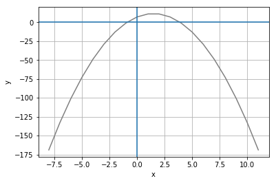
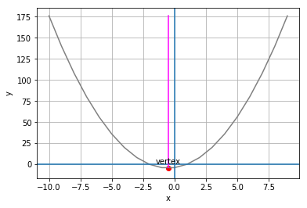
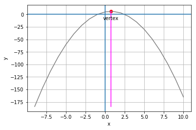
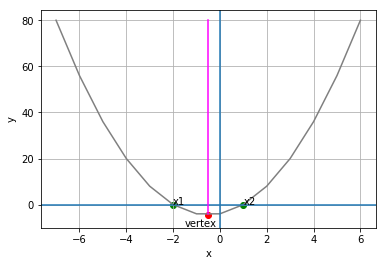
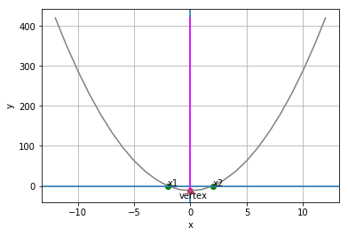
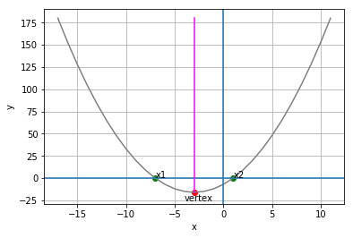
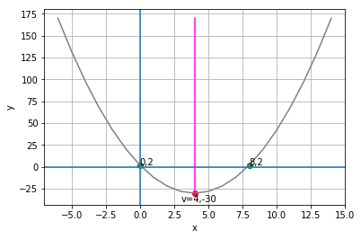
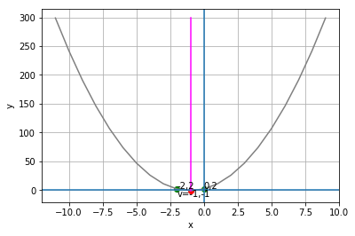
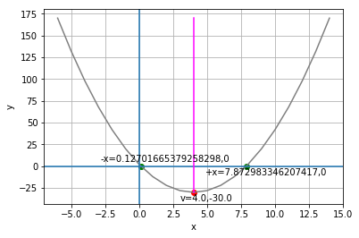

# Quadratic Equations

Consider the following equation:

\begin{equation}y = 2(x - 1)(x + 2)\end{equation}

If you multiply out the factored ***x*** expressions, this equates to:

\begin{equation}y = 2x^{2} + 2x - 4\end{equation}

Note that the highest ordered term includes a squared variable (x<sup>2</sup>).

Let's graph this equation for a range of ***x*** values:


```python
import pandas as pd

# Create a dataframe with an x column containing values to plot
df = pd.DataFrame ({'x': range(-9, 9)})

# Add a y column by applying the quadratic equation to x
df['y'] = 2*df['x']**2 + 2 *df['x'] - 4

# Plot the line
%matplotlib inline
from matplotlib import pyplot as plt

plt.plot(df.x, df.y, color="grey")
plt.xlabel('x')
plt.ylabel('y')
plt.grid()
plt.axhline()
plt.axvline()
plt.show()
```


Note that the graph shows a *parabola*, which is an arc-shaped line that reflects the x and y values calculated for the equation.

Now let's look at another equation that includes an ***x<sup>2</sup>*** term:

\begin{equation}y = -2x^{2} + 6x + 7\end{equation}

What does that look like as a graph?:


```python
import pandas as pd

# Create a dataframe with an x column containing values to plot
df = pd.DataFrame ({'x': range(-8, 12)})

# Add a y column by applying the quadratic equation to x
df['y'] = -2*df['x']**2 + 6*df['x'] + 7

# Plot the line
%matplotlib inline
from matplotlib import pyplot as plt

plt.plot(df.x, df.y, color="grey")
plt.xlabel('x')
plt.ylabel('y')
plt.grid()
plt.axhline()
plt.axvline()
plt.show()
```





Again, the graph shows a parabola, but this time instead of being open at the top, the parabola is open at the bottom.

Equations that assign a value to ***y*** based on an expression that includes a squared value for ***x*** create parabolas. If the relationship between ***y*** and ***x*** is such that ***y*** is a *positive* multiple of the ***x<sup>2</sup>*** term, the parabola will be open at the top; when ***y*** is a *negative* multiple of the ***x<sup>2</sup>*** term, then the parabola will be open at the bottom.

These kinds of equations are known as *quadratic* equations, and they have some interesting characteristics. There are several ways quadratic equations can be written, but the *standard form* for quadratic equation is:

\begin{equation}y = ax^{2} + bx + c\end{equation}

Where ***a***, ***b***, and ***c*** are numeric coefficients or constants.

Let's start by examining the parabolas generated by quadratic equations in more detail.

## Parabola Vertex and Line of Symmetry
Parabolas are symmetrical, with x and y values converging exponentially towards the highest point (in the case of a downward opening parabola) or lowest point (in the case of an upward opening parabola). The point where the parabola meets the line of symmetry is known as the *vertex*.

Run the following cell to see the line of symmetry and vertex for the two parabolas described previously (don't worry about the calculations used to find the line of symmetry and vertex - we'll explore that later):


```python
%matplotlib inline

def plot_parabola(a, b, c):
    import pandas as pd
    import numpy as np
    from matplotlib import pyplot as plt
    
    # get the x value for the line of symmetry
    vx = (-1*b)/(2*a)
    
    # get the y value when x is at the line of symmetry
    vy = a*vx**2 + b*vx + c

    # Create a dataframe with an x column containing values from x-10 to x+10
    minx = int(vx - 10)
    maxx = int(vx + 11)
    df = pd.DataFrame ({'x': range(minx, maxx)})

    # Add a y column by applying the quadratic equation to x
    df['y'] = a*df['x']**2 + b *df['x'] + c

    # get min and max y values
    miny = df.y.min()
    maxy = df.y.max()

    # Plot the line
    plt.plot(df.x, df.y, color="grey")
    plt.xlabel('x')
    plt.ylabel('y')
    plt.grid()
    plt.axhline()
    plt.axvline()

    # plot the line of symmetry
    sx = [vx, vx]
    sy = [miny, maxy]
    plt.plot(sx,sy, color='magenta')

    # Annotate the vertex
    plt.scatter(vx,vy, color="red")
    plt.annotate('vertex',(vx, vy), xytext=(vx - 1, (vy + 5)* np.sign(a)))

    plt.show()


plot_parabola(2, 2, -4)   

plot_parabola(-2, 3, 5) 
```








## Parabola Intercepts
Recall that linear equations create lines that intersect the **x** and **y** axis of a graph, and we call the points where these intersections occur *intercepts*. Now look at the graphs of the parabolas we've worked with so far. Note that these parabolas both have a y-intercept; a point where the line intersects the y axis of the graph (in other words, when x is 0). However, note that the parabolas have *two* x-intercepts; in other words there are two points at which the line crosses the x axis (and y is 0). Additionally, imagine a downward opening parabola with its vertex at -1, -1. This is perfectly possible, and the line would never have an x value greater than -1, so it would have *no* x-intercepts.

Regardless of whether the parabola crosses the x axis or not, other than the vertex, for every ***y*** point in the parabola, there are *two* ***x*** points; one on the right (or positive) side of the axis of symmetry, and one of the left (or negative) side. The implications of this are what make quadratic equations so interesting. When we solve the equation for ***x***, there are *two* correct answers.

Let's take a look at an example to demonstrate this. Let's return to the first of our quadratic equations, and we'll look at it in its *factored* form:

\begin{equation}y = 2(x - 1)(x + 2)\end{equation}

Now, let's solve this equation for a ***y*** value of 0. We can restate the equation like this:

\begin{equation}2(x - 1)(x + 2) = 0\end{equation}

The equation is the product of two expressions **2(x - 1)** and **(x + 2)**. In this case, we know that the product of these expressions is 0, so logically *one or both of the expressions must return 0*.

Let's try the first one:

\begin{equation}2(x - 1) = 0\end{equation}

If we distrbute this, we get:

\begin{equation}2x - 2 = 0\end{equation}

This simplifies to:

\begin{equation}2x = 2\end{equation}

Which gives us a value for *x* of **1**.

Now let's try the other expression:

\begin{equation}x + 2 = 0\end{equation}

This gives us a value for *x* of **-2**.

So, when *y* is **0**, *x* is **-2** or **1**. Let's plot these points on our parabola:


```python
import pandas as pd

# Assign the calculated x values
x1 = -2
x2 = 1

# Create a dataframe with an x column containing some values to plot
df = pd.DataFrame ({'x': range(x1-5, x2+6)})

# Add a y column by applying the quadratic equation to x
df['y'] = 2*(df['x'] - 1) * (df['x'] + 2)

# Get x at the line of symmetry (halfway between x1 and x2)
vx = (x1 + x2) / 2

# Get y when x is at the line of symmetry
vy = 2*(vx -1)*(vx + 2)

# get min and max y values
miny = df.y.min()
maxy = df.y.max()

# Plot the line
%matplotlib inline
from matplotlib import pyplot as plt

plt.plot(df.x, df.y, color="grey")
plt.xlabel('x')
plt.ylabel('y')
plt.grid()
plt.axhline()
plt.axvline()

# Plot calculated x values for y = 0
plt.scatter([x1,x2],[0,0], color="green")
plt.annotate('x1',(x1, 0))
plt.annotate('x2',(x2, 0))

# plot the line of symmetry
sx = [vx, vx]
sy = [miny, maxy]
plt.plot(sx,sy, color='magenta')

# Annotate the vertex
plt.scatter(vx,vy, color="red")
plt.annotate('vertex',(vx, vy), xytext=(vx - 1, (vy - 5)))

plt.show()
```





So from the plot, we can see that both of the values we calculated for ***x*** align with the parabola when ***y*** is 0. Additionally, because the parabola is symmetrical, we know that every pair of ***x*** values for each ***y*** value will be equidistant from the line of symmetry, so we can calculate the ***x*** value for the line of symmetry as the average of the ***x*** values for any value of ***y***. This in turn means that we know the ***x*** coordinate for the vertex (it's on the line of symmetry), and we can use the quadratic equation to calculate ***y*** for this point.

## Solving Quadratics Using the Square Root Method
The technique we just looked at makes it easy to calculate the two possible values for ***x*** when ***y*** is 0 if the equation is presented as the product two expressions. If the equation is in standard form, and it can be factored, you could do the necessary manipulation to restate it as the product of two expressions. Otherwise, you can calculate the possible values for x by applying a different method that takes advantage of the relationship between squared values and the square root.

Let's consider this equation:

\begin{equation}y = 3x^{2} - 12\end{equation}

Note that this is in the standard quadratic form, but there is no *b* term; in other words, there's no term that contains a coeffecient for  ***x*** to the first power. This type of equation can be easily solved using the square root method. Let's restate it so we're solving for ***x*** when ***y*** is 0:

\begin{equation}3x^{2} - 12 = 0\end{equation}

The first thing we need to do is to isolate the ***x<sup>2</sup>*** term, so we'll remove the constant on the left by adding 12 to both sides:

\begin{equation}3x^{2} = 12\end{equation}

Then we'll divide both sides by 3 to isolate x<sup>2</sup>:

\begin{equation}x^{2} = 4\end{equation}

No we can isolate ***x*** by taking the square root of both sides. However, there's an additional consideration because this is a quadratic equation. The ***x*** variable can have two possibe values, so we must calculate the *principle* and *negative* square roots of the expression on the right:

\begin{equation}x = \pm\sqrt{4}\end{equation}

The principle square root of 4 is 2 (because 2<sup>2</sup> is 4), and the corresponding negative root is -2 (because -2<sup>2</sup> is also 4); so *x* is **2** or **-2**.

Let's see this in Python, and use the results to calculate and plot the parabola with its line of symmetry and vertex:


```python
import pandas as pd
import math

y = 0
x1 = int(- math.sqrt(y + 12 / 3))
x2 = int(math.sqrt(y + 12 / 3))

# Create a dataframe with an x column containing some values to plot
df = pd.DataFrame ({'x': range(x1-10, x2+11)})

# Add a y column by applying the quadratic equation to x
df['y'] = 3*df['x']**2 - 12

# Get x at the line of symmetry (halfway between x1 and x2)
vx = (x1 + x2) / 2

# Get y when x is at the line of symmetry
vy = 3*vx**2 - 12

# get min and max y values
miny = df.y.min()
maxy = df.y.max()

# Plot the line
%matplotlib inline
from matplotlib import pyplot as plt

plt.plot(df.x, df.y, color="grey")
plt.xlabel('x')
plt.ylabel('y')
plt.grid()
plt.axhline()
plt.axvline()

# Plot calculated x values for y = 0
plt.scatter([x1,x2],[0,0], color="green")
plt.annotate('x1',(x1, 0))
plt.annotate('x2',(x2, 0))

# plot the line of symmetry
sx = [vx, vx]
sy = [miny, maxy]
plt.plot(sx,sy, color='magenta')

# Annotate the vertex
plt.scatter(vx,vy, color="red")
plt.annotate('vertex',(vx, vy), xytext=(vx - 1, (vy - 20)))

plt.show()
```





## Solving Quadratics Using the Completing the Square Method
In quadratic equations where there is a *b* term; that is, a term containing **x** to the first power, it is impossible to directly calculate the square root. However, with some algebraic manipulation, you can take advantage of the ability to factor a polynomial expression in the form *a<sup>2</sup> + 2ab + b<sup>2</sup>* as a binomial *perfect square* expression in the form *(a + b)<sup>2</sup>*.

At first this might seem like some sort of mathematical sleight of hand, but follow through the steps carefull and you'll see that there's nothing up my sleeve!

The underlying basis of this approach is that a trinomial expression like this:

\begin{equation}x^{2} + 24x + 12^{2}\end{equation}

Can be factored to this:

\begin{equation}(x + 12)^{2}\end{equation}

OK, so how does this help us solve a quadratic equation? Well, let's look at an example:

\begin{equation}y = x^{2} + 6x - 7\end{equation}

Let's start as we've always done so far by restating the equation to solve ***x*** for a ***y*** value of 0:

\begin{equation}x^{2} + 6x - 7 = 0\end{equation}

Now we can move the constant term to the right by adding 7 to both sides:

\begin{equation}x^{2} + 6x = 7\end{equation}

OK, now let's look at the expression on the left: *x<sup>2</sup> + 6x*. We can't take the square root of this, but we can turn it into a trinomial that will factor into a perfect square by adding a squared constant. The question is, what should that constant be? Well, we know that we're looking for an expression like *x<sup>2</sup> + 2**c**x + **c**<sup>2</sup>*, so our constant **c** is half of the coefficient we currently have for ***x***. This is **6**, making our constant **3**, which when squared is **9** So we can create a trinomial expression that will easily factor to a perfect square by adding 9; giving us the expression *x<sup>2</sup> + 6x + 9*.

However, we can't just add something to one side without also adding it to the other, so our equation becomes:

\begin{equation}x^{2} + 6x + 9 = 16\end{equation}

So, how does that help? Well, we can now factor the trinomial expression as a perfect square binomial expression:

\begin{equation}(x + 3)^{2} = 16\end{equation}

And now, we can use the square root method to find x + 3:

\begin{equation}x + 3 =\pm\sqrt{16}\end{equation}

So, x + 3 is **-4** or **4**. We isolate ***x*** by subtracting 3 from both sides, so ***x*** is **-7** or **1**:

\begin{equation}x = -7, 1\end{equation}

Let's see what the parabola for this equation looks like in Python:


```python
import pandas as pd
import math

x1 = int(- math.sqrt(16) - 3)
x2 = int(math.sqrt(16) - 3)

# Create a dataframe with an x column containing some values to plot
df = pd.DataFrame ({'x': range(x1-10, x2+11)})

# Add a y column by applying the quadratic equation to x
df['y'] = ((df['x'] + 3)**2) - 16

# Get x at the line of symmetry (halfway between x1 and x2)
vx = (x1 + x2) / 2

# Get y when x is at the line of symmetry
vy = ((vx + 3)**2) - 16

# get min and max y values
miny = df.y.min()
maxy = df.y.max()

# Plot the line
%matplotlib inline
from matplotlib import pyplot as plt

plt.plot(df.x, df.y, color="grey")
plt.xlabel('x')
plt.ylabel('y')
plt.grid()
plt.axhline()
plt.axvline()

# Plot calculated x values for y = 0
plt.scatter([x1,x2],[0,0], color="green")
plt.annotate('x1',(x1, 0))
plt.annotate('x2',(x2, 0))

# plot the line of symmetry
sx = [vx, vx]
sy = [miny, maxy]
plt.plot(sx,sy, color='magenta')

# Annotate the vertex
plt.scatter(vx,vy, color="red")
plt.annotate('vertex',(vx, vy), xytext=(vx - 1, (vy - 10)))

plt.show()
```





## Vertex Form
Let's look at another example of a quadratic equation in standard form:

\begin{equation}y = 2x^{2} - 16x + 2\end{equation}

We can start to solve this by subtracting 2 from both sides to move the constant term from the right to the left:

\begin{equation}y - 2 = 2x^{2} - 16x\end{equation}

Now we can factor out the coefficient for x<sup>2</sup>, which is **2**. 2x<sup>2</sup> is 2 &bull; x<sup>2</sup>, and -16x is 2 &bull; 8x:

\begin{equation}y - 2 = 2(x^{2} - 8x)\end{equation}

Now we're ready to complete the square, so we add the square of half of the -8x coefficient on the right side to the parenthesis. Half of -8 is -4, and -4<sup>2</sup> is 16, so the right side of the equation becomes *2(x<sup>2</sup> - 8x + 16)*. Of course, we can't add something to one side of the equation without also adding it to the other side, and we've just added 2 &bull; 16 (which is 32) to the right, so we must also add that to the left.

\begin{equation}y - 2 + 32 = 2(x^{2} - 8x + 16)\end{equation}

Now we can simplify the left and factor out a perfect square binomial expression on the right:

\begin{equation}y + 30 = 2(x - 4)^{2}\end{equation}

We now have a squared term for ***x***, so we could use the square root method to solve the equation. However, we can also isolate ***y*** by subtracting 30 from both sides. So we end up restating the original equation as:

\begin{equation}y = 2(x - 4)^{2} - 30\end{equation}

Let's just quickly check our math with Python:


```python
from random import randint
x = randint(1,100)

2*x**2 - 16*x + 2 == 2*(x - 4)**2 - 30
```


    True


So we've managed to take the expression ***2x<sup>2</sup> - 16x + 2*** and change it to ***2(x - 4)<sup>2</sup> - 30***. How does that help?

Well, when a quadratic equation is stated this way, it's in *vertex form*, which is generically described as:

\begin{equation}y = a(x - h)^{2} + k\end{equation}

The neat thing about this form of the equation is that it tells us the coordinates of the vertex - it's at ***h,k***.

So in this case, we know that the vertex of our equation is 4, -30. Moreover, we know that the line of symmetry is at ***x = 4***.

We can then just use the equation to calculate two more points, and the three points will be enough for us to determine the shape of the parabola. We can simply choose any ***x*** value we like and substitute it into the equation to calculate the corresponding ***y*** value. For example, let's calculate ***y*** when x is **0**:

\begin{equation}y = 2(0 - 4)^{2} - 30\end{equation}

When we work through the equation, it gives us the answer **2**, so we know that the point 0, 2 is in our parabola.

So, we know that the line of symmetry is at ***x = h*** (which is 4), and we now know that the ***y*** value when ***x*** is 0 (***h*** - ***h***) is 2. The ***y*** value at the same distance from the line of symmetry in the negative direction will be the same as the value in the positive direction, so when ***x*** is ***h*** + ***h***, the ***y*** value will also be 2.

The following Python code encapulates all of this in a function that draws and annotates a parabola using only the ***a***, ***h***, and ***k*** values from a quadratic equation in vertex form:


```python
def plot_parabola_from_vertex_form(a, h, k):
    import pandas as pd
    import math

    # Create a dataframe with an x column a range of x values to plot
    df = pd.DataFrame ({'x': range(h-10, h+11)})

    # Add a y column by applying the quadratic equation to x
    df['y'] = (a*(df['x'] - h)**2) + k

    # get min and max y values
    miny = df.y.min()
    maxy = df.y.max()

    # calculate y when x is 0 (h+-h)
    y = a*(0 - h)**2 + k

    # Plot the line
    %matplotlib inline
    from matplotlib import pyplot as plt

    plt.plot(df.x, df.y, color="grey")
    plt.xlabel('x')
    plt.ylabel('y')
    plt.grid()
    plt.axhline()
    plt.axvline()

    # Plot calculated y values for x = 0 (h-h and h+h)
    plt.scatter([h-h, h+h],[y,y], color="green")
    plt.annotate(str(h-h) + ',' + str(y),(h-h, y))
    plt.annotate(str(h+h) + ',' + str(y),(h+h, y))

    # plot the line of symmetry (x = h)
    sx = [h, h]
    sy = [miny, maxy]
    plt.plot(sx,sy, color='magenta')

    # Annotate the vertex (h,k)
    plt.scatter(h,k, color="red")
    plt.annotate('v=' + str(h) + ',' + str(k),(h, k), xytext=(h - 1, (k - 10)))

    plt.show()

    
# Call the function for the example discussed above
plot_parabola_from_vertex_form(2, 4, -30)
```





It's important to note that the vertex form specifically requires a *subtraction* operation in the factored perfect square term. For example, consider the following equation in the standard form:

\begin{equation}y = 3x^{2} + 6x + 2\end{equation}

The steps to solve this are:
1. Move the constant to the left side:
\begin{equation}y - 2 = 3x^{2} + 6x\end{equation}
2. Factor the ***x*** expressions on the right:
\begin{equation}y - 2 = 3(x^{2} + 2x)\end{equation}
3. Add the square of half the x coefficient to the right, and the corresponding multiple on the left:
\begin{equation}y - 2 + 3 = 3(x^{2} + 2x + 1)\end{equation}
4. Factor out a perfect square binomial:
\begin{equation}y + 1 = 3(x + 1)^{2}\end{equation}
5. Move the constant back to the right side:
\begin{equation}y = 3(x + 1)^{2} - 1\end{equation}

To express this in vertex form, we need to convert the addition in the parenthesis to a subtraction:

\begin{equation}y = 3(x - -1)^{2} - 1\end{equation}

Now, we can use the a, h, and k values to define a parabola:


```python
plot_parabola_from_vertex_form(3, -1, -1)
```





## Shortcuts for Solving Quadratic Equations
We've spent some time in this notebook discussing how to solve quadratic equations to determine the vertex of a parabola and the ***x*** values in relation to ***y***. It's important to understand the techniques we've used, which incude:
- Factoring
- Calculating the Square Root
- Completing the Square
- Using the vertex form of the equation

The underlying algebra for all of these techniques is the same, and this consistent algebra results in some shortcuts that you can memorize to make it easier to solve quadratic equations without going through all of the steps:

### Calculating the Vertex from Standard Form
You've already seen that converting a quadratic equation to the vertex form makes it easy to identify the vertex coordinates, as they're encoded as ***h*** and ***k*** in the equation itself - like this:

\begin{equation}y = a(x - \textbf{h})^{2} + \textbf{k}\end{equation}

However, what if you have an equation in standard form?:

\begin{equation}y = ax^{2} + bx + c\end{equation}

There's a quick and easy technique you can apply to get the vertex coordinates. 

1. To find ***h*** (which is the x-coordinate of the vertex), apply the following formula:
\begin{equation}h = \frac{-b}{2a}\end{equation}
2. After you've found ***h***, use it in the quadratic equation to solve for ***k***:
\begin{equation}\textbf{k} = a\textbf{h}^{2} + b\textbf{h} + c\end{equation}

For example, here's the quadratic equation in standard form that we previously converted to the vertex form:

\begin{equation}y = 2x^{2} - 16x + 2\end{equation}

To find ***h***, we perform the following calculation:

\begin{equation}h = \frac{-b}{2a}\;\;\;\;=\;\;\;\;\frac{-1 \cdot16}{2\cdot2}\;\;\;\;=\;\;\;\;\frac{16}{4}\;\;\;\;=\;\;\;\;4\end{equation}

Then we simply plug the value we've obtained for ***h*** into the quadratic equation in order to find ***k***:

\begin{equation}k = 2\cdot(4^{2}) - 16\cdot4 + 2\;\;\;\;=\;\;\;\;32 - 64 + 2\;\;\;\;=\;\;\;\;-30\end{equation}

Note that a vertex at 4,-30 is also what we previously calculated for the vertex form of the same equation:

\begin{equation}y = 2(x - 4)^{2} - 30\end{equation}

### The Quadratic Formula
Another useful formula to remember is the *quadratic formula*, which makes it easy to calculate values for ***x*** when ***y*** is **0**; or in other words:

\begin{equation}ax^{2} + bx + c = 0\end{equation}

Here's the formula:

\begin{equation}x = \frac{-b \pm \sqrt{b^{2} - 4ac}}{2a}\end{equation}

Let's apply that formula to our equation, which you may remember looks like this:

\begin{equation}y = 2x^{2} - 16x + 2\end{equation}

OK, let's plug the ***a***, ***b***, and ***c*** variables from our equation into the quadratic formula:

\begin{equation}x = \frac{--16 \pm \sqrt{-16^{2} - 4\cdot2\cdot2}}{2\cdot2}\end{equation}

This simplifes to:

\begin{equation}x = \frac{16 \pm \sqrt{256 - 16}}{4}\end{equation}

This in turn (with the help of a calculator) simplifies to:

\begin{equation}x = \frac{16 \pm 15.491933384829668}{4}\end{equation}

So our positive value for ***x*** is:

\begin{equation}x = \frac{16 + 15.491933384829668}{4}\;\;\;\;=7.872983346207417\end{equation}

And the negative value for ***x*** is:

\begin{equation}x = \frac{16 - 15.491933384829668}{4}\;\;\;\;=0.12701665379258298\end{equation}


The following Python code uses the vertex formula and the quadtratic formula to calculate the vertex and the -x and +x for y = 0, and then plots the resulting parabola:


```python
def plot_parabola_from_formula (a, b, c):
    import math

    # Get vertex
    print('CALCULATING THE VERTEX')
    print('vx = -b / 2a')

    nb = -b
    a2 = 2*a
    print('vx = ' + str(nb) + ' / ' + str(a2))

    vx = -b/(2*a)
    print('vx = ' + str(vx))

    print('\nvy = ax^2 + bx + c')
    print('vy =' + str(a) + '(' + str(vx) + '^2) + ' + str(b) + '(' + str(vx) + ') + ' + str(c))

    avx2 = a*vx**2
    bvx = b*vx
    print('vy =' + str(avx2) + ' + ' + str(bvx) + ' + ' + str(c))

    vy = avx2 + bvx + c
    print('vy = ' + str(vy))

    print ('\nv = ' + str(vx) + ',' + str(vy))

    # Get +x and -x (showing intermediate calculations)
    print('\nCALCULATING -x AND +x FOR y=0')
    print('x = -b +- sqrt(b^2 - 4ac) / 2a')


    b2 = b**2
    ac4 = 4*a*c
    print('x = ' + str(nb) + '+-sqrt(' + str(b2) + ' - ' + str(ac4) + ')/' + str(a2))

    sr = math.sqrt(b2 - ac4)
    print('x = ' + str(nb) + ' +- ' + str(sr) + ' / ' + str(a2))
    print('-x = ' + str(nb) + ' - ' + str(sr) + ' / ' + str(a2))
    print('+x = ' + str(nb) + ' + ' + str(sr) + ' / ' + str(a2))

    posx = (nb + sr) / a2
    negx = (nb - sr) / a2
    print('-x = ' + str(negx))
    print('+x = ' + str(posx))


    print('\nPLOTTING THE PARABOLA')
    import pandas as pd

    # Create a dataframe with an x column a range of x values to plot
    df = pd.DataFrame ({'x': range(round(vx)-10, round(vx)+11)})

    # Add a y column by applying the quadratic equation to x
    df['y'] = a*df['x']**2 + b*df['x'] + c

    # get min and max y values
    miny = df.y.min()
    maxy = df.y.max()

    # Plot the line
    %matplotlib inline
    from matplotlib import pyplot as plt

    plt.plot(df.x, df.y, color="grey")
    plt.xlabel('x')
    plt.ylabel('y')
    plt.grid()
    plt.axhline()
    plt.axvline()

    # Plot calculated x values for y = 0
    plt.scatter([negx, posx],[0,0], color="green")
    plt.annotate('-x=' + str(negx) + ',' + str(0),(negx, 0), xytext=(negx - 3, 5))
    plt.annotate('+x=' + str(posx) + ',' + str(0),(posx, 0), xytext=(posx - 3, -10))

    # plot the line of symmetry
    sx = [vx, vx]
    sy = [miny, maxy]
    plt.plot(sx,sy, color='magenta')

    # Annotate the vertex
    plt.scatter(vx,vy, color="red")
    plt.annotate('v=' + str(vx) + ',' + str(vy),(vx, vy), xytext=(vx - 1, vy - 10))

    plt.show()
    

plot_parabola_from_formula (2, -16, 2)
```

    CALCULATING THE VERTEX
    vx = -b / 2a
    vx = 16 / 4
    vx = 4.0
    
    vy = ax^2 + bx + c
    vy =2(4.0^2) + -16(4.0) + 2
    vy =32.0 + -64.0 + 2
    vy = -30.0
    
    v = 4.0,-30.0
    
    CALCULATING -x AND +x FOR y=0
    x = -b +- sqrt(b^2 - 4ac) / 2a
    x = 16+-sqrt(256 - 16)/4
    x = 16 +- 15.491933384829668 / 4
    -x = 16 - 15.491933384829668 / 4
    +x = 16 + 15.491933384829668 / 4
    -x = 0.12701665379258298
    +x = 7.872983346207417
    
    PLOTTING THE PARABOLA
    




