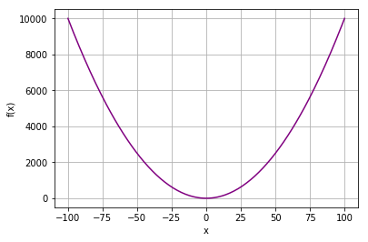
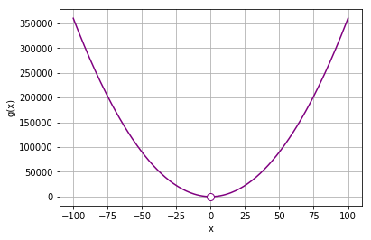
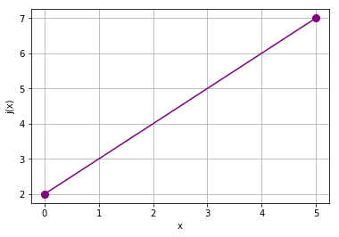
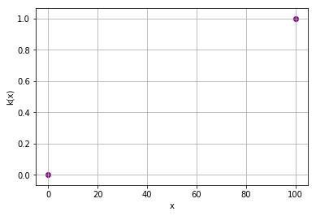
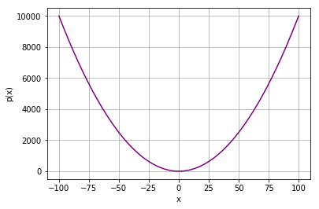

# Functions
So far in this course we've explored equations that perform algebraic operations to produce one or more results. A *function* is a way of encapsulating an operation that takes an input and produces exactly one ouput.

For example, consider the following function definition:

\begin{equation}f(x) = x^{2} + 2\end{equation}

This defines a function named ***f*** that accepts one input (***x***) and returns a single value that is the result calculated by the expression *x<sup>2</sup> + 2*.

Having defined the function, we can use it for any input value. For example:

\begin{equation}f(3) = 11\end{equation}

You've already seen a few examples of Python functions, which are defined using the **def** keyword. However, the strict definition of an algebraic function is that it must return a single value. Here's an example of defining and using a Python function that meets this criteria:


```python
# define a function to return x^2 + 2
def f(x):
    return x**2 + 2

# call the function
f(3)
```


    11


You can use functions in equations, just like any other term. For example, consider the following equation:

\begin{equation}y = f(x) - 1\end{equation}

To calculate a value for ***y***, we take the ***f*** of ***x*** and subtract 1. So assuming that ***f*** is defined as previously, given an ***x*** value of 4, this equation returns a ***y*** value of **17** (*f*(4) returns 4<sup>2</sup> + 2, so 16 + 2 = 18; and then the equation subtracts 1 to give us 17). Here it is in Python:


```python
x = 4
y = f(x) - 1
print(y)
```

    17
    

Of course, the value returned by a function depends on the input; and you can graph this with the iput (let's call it ***x***) on one axis and the output (***f(x)***) on the other.


```python
%matplotlib inline

import numpy as np
from matplotlib import pyplot as plt

# Create an array of x values from -100 to 100
x = np.array(range(-100, 101))

# Set up the graph
plt.xlabel('x')
plt.ylabel('f(x)')
plt.grid()

# Plot x against f(x)
plt.plot(x,f(x), color='purple')

plt.show()
```





As you can see (if you hadn't already figured it out), our function is a *quadratic function* - it returns a squared value that results in a parabolic graph when the output for multiple input values are plotted.

## Bounds of a Function
Some functions will work for any input and may return any output. For example, consider the function ***u*** defined here:

\begin{equation}u(x) = x + 1\end{equation}

This function simply adds 1 to whatever input is passed to it, so it will produce a defined output for any value of ***x*** that is a *real* number; in other words, any "regular" number - but not an *imaginary* number like &radic;-1, or &infin; (infinity). You can specify the set of real numbers using the symbol ${\rm I\!R}$ (note the double stroke). The values that can be used for ***x*** can be expressed as a *set*, which we indicate by enclosing all of the members of the set in "{...}" braces; so to indicate the set of all possible values for x such that x is a member of the set of all real numbers, we can use the following expression:

\begin{equation}\{x \in \rm I\!R\}\end{equation}


### Domain of a Function
We call the set of numbers for which a function can return value it's *domain*, and in this case, the domain of ***u*** is the set of all real numbers; which is actually the default assumption for most functions.

Now consider the following function ***g***:

\begin{equation}g(x) = (\frac{12}{2x})^{2}\end{equation}

If we use this function with an ***x*** value of **2**, we would get the output **9**; because (12 &div; (2&bull;2))<sup>2</sup> is 9. Similarly, if we use the value **-3** for ***x***, the output will be **4**. However, what happens when we apply this function to an ***x*** value of **0**? Anything divided by 0 is undefined, so the function ***g*** doesn't work for an ***x*** value of 0.

So we need a way to denote the domain of the function ***g*** by indicating the input values for which a defined output can be returned. Specifically, we need to restrict ***x*** to a specific list of values - specifically any real number that is not 0. To indicate this, we can use the following notation:

\begin{equation}\{x \in \rm I\!R\;\;|\;\; x \ne 0 \}\end{equation}

This is interpreted as *Any value for x where x is in the set of real numbers such that x is not equal to 0*, and we can incorporate this into the function's definition like this:

\begin{equation}g(x) = (\frac{12}{2x})^{2}, \{x \in \rm I\!R\;\;|\;\; x \ne 0 \}\end{equation}

Or more simply:

\begin{equation}g(x) = (\frac{12}{2x})^{2},\;\; x \ne 0\end{equation}

When you plot the output of a function, you can indicate the gaps caused by input values that are not in the function's domain by plotting an empty circle to show that the function is not defined at this point:


```python
%matplotlib inline

# Define function g
def g(x):
    if x != 0:
        return (12/2*x)**2

# Plot output from function g
import numpy as np
from matplotlib import pyplot as plt

# Create an array of x values from -100 to 100
x = range(-100, 101)

# Get the corresponding y values from the function
y = [g(a) for a in x]

# Set up the graph
plt.xlabel('x')
plt.ylabel('g(x)')
plt.grid()

# Plot x against g(x)
plt.plot(x,y, color='purple')

# plot an empty circle to show the undefined point
plt.plot(0,g(0.0000001), color='purple', marker='o', markerfacecolor='w', markersize=8)

plt.show()
```





Note that the function works for every value other than 0; so the function is defined for x = 0.000000001, and for x = -0.000000001; it only fails to return a defined value for exactly 0.

OK, let's take another example. Consider this function:

\begin{equation}h(x) = 2\sqrt{x}\end{equation}

Applying this function to a non-negative ***x*** value returns a meaningful output; but for any value where ***x*** is negative, the output is undefined.

We can indicate the domain of this function in its definition like this:

\begin{equation}h(x) = 2\sqrt{x}, \{x \in \rm I\!R\;\;|\;\; x \ge 0 \}\end{equation}

This is interpreted as *Any value for x where x is in the set of real numbers such that x is greater than or equal to 0*.

Or, you might see this in a simpler format:

\begin{equation}h(x) = 2\sqrt{x},\;\; x \ge 0\end{equation}

Note that the symbol &ge; is used to indicate that the value must be *greater than **or equal to*** 0; and this means that **0** is included in the set of valid values. To indicate that the value must be *greater than 0, **not including 0***, use the &gt; symbol. You can also use the equivalent symbols for *less than or equal to* (&le;) and *less than* (&lt;).

When plotting a function line that marks the end of a continuous range, the end of the line is shown as a circle, which is filled if the function includes the value at that point, and unfilled if it does not.

Here's the Python to plot function ***h***:


```python
%matplotlib inline

def h(x):
    if x >= 0:
        import numpy as np
        return 2 * np.sqrt(x)

# Plot output from function h
import numpy as np
from matplotlib import pyplot as plt

# Create an array of x values from -100 to 100
x = range(-100, 101)

# Get the corresponding y values from the function
y = [h(a) for a in x]

# Set up the graph
plt.xlabel('x')
plt.ylabel('h(x)')
plt.grid()

# Plot x against h(x)
plt.plot(x,y, color='purple')

# plot a filled circle at the end to indicate a closed interval
plt.plot(0, h(0), color='purple', marker='o', markerfacecolor='purple', markersize=8)

plt.show()
```


Sometimes, a function may be defined for a specific *interval*; for example, for all values between 0 and 5:

\begin{equation}j(x) = x + 2,\;\; x \ge 0 \text{ and } x \le 5\end{equation}

In this case, the function is defined for ***x*** values between 0 and 5 *inclusive*; in other words, **0** and **5** are included in the set of defined values. This is known as a *closed* interval and can be indicated like this:

\begin{equation}\{x \in \rm I\!R\;\;|\;\; 0 \le x \le 5 \}\end{equation}

It could also be indicated like this:

\begin{equation}\{x \in \rm I\!R\;\;|\;\; [0,5] \}\end{equation}

If the condition in the function was **x > 0 and x < 5**, then the interval would be described as *open* and 0 and 5 would *not* be included in the set of defined values. This would be indicated using one of the following expressions:

\begin{equation}\{x \in \rm I\!R\;\;|\;\; 0 \lt x \lt 5 \}\end{equation}
\begin{equation}\{x \in \rm I\!R\;\;|\;\; (0,5) \}\end{equation}

Here's function ***j*** in Python:


```python
%matplotlib inline

def j(x):
    if x >= 0 and x <= 5:
        return x + 2

    
# Plot output from function j
import numpy as np
from matplotlib import pyplot as plt

# Create an array of x values from -100 to 100
x = range(-100, 101)
y = [j(a) for a in x]

# Set up the graph
plt.xlabel('x')
plt.ylabel('j(x)')
plt.grid()

# Plot x against k(x)
plt.plot(x, y, color='purple')

# plot a filled circle at the ends to indicate an open interval
plt.plot(0, j(0), color='purple', marker='o', markerfacecolor='purple', markersize=8)
plt.plot(5, j(5), color='purple', marker='o', markerfacecolor='purple', markersize=8)

plt.show()
```





Now, suppose we have a function like this:

\begin{equation}
k(x) = \begin{cases}
  0, & \text{if } x = 0, \\
  1, & \text{if } x = 100
\end{cases}
\end{equation}

In this case, the function has highly restricted domain; it only returns a defined output for 0 and 100. No output for any other ***x*** value is defined. In this case, the set of the domain is:

\begin{equation}\{0,100\}\end{equation}

Note that this does not include all real numbers, it only includes 0 and 100.

When we use Python to plot this function, note that it only makes sense to plot a scatter plot showing the individual values returned, there is no line in between because the function is not continuous between the values within the domain. 


```python
%matplotlib inline

def k(x):
    if x == 0:
        return 0
    elif x == 100:
        return 1

    
# Plot output from function k
from matplotlib import pyplot as plt

# Create an array of x values from -100 to 100
x = range(-100, 101)
# Get the k(x) values for every value in x
y = [k(a) for a in x]

# Set up the graph
plt.xlabel('x')
plt.ylabel('k(x)')
plt.grid()

# Plot x against k(x)
plt.scatter(x, y, color='purple')

plt.show()
```





### Range of a Function
Just as the domain of a function defines the set of values for which the function is defined, the *range* of a function defines the set of possible outputs from the function.

For example, consider the following function:

\begin{equation}p(x) = x^{2} + 1\end{equation}

The domain of this function is all real numbers. However, this is a quadratic function, so the output values will form a parabola; and since the function has no negative coefficient or constant, it will be an upward opening parabola with a vertex that has a y value of 1.

So what does that tell us? Well, the minimum value that will be returned by this function is 1, so it's range is:

\begin{equation}\{p(x) \in \rm I\!R\;\;|\;\; p(x) \ge 1 \}\end{equation}

Let's create and plot the function for a range of ***x*** values in Python:


```python
%matplotlib inline

# define a function to return x^2 + 1
def p(x):
    return x**2 + 1


# Plot the function
import numpy as np
from matplotlib import pyplot as plt

# Create an array of x values from -100 to 100
x = np.array(range(-100, 101))

# Set up the graph
plt.xlabel('x')
plt.ylabel('p(x)')
plt.grid()

# Plot x against f(x)
plt.plot(x,p(x), color='purple')

plt.show()
```





Note that the ***p(x)*** values in the plot drop exponentially for ***x*** values that are negative, and then rise exponentially for positive ***x*** values; but the minimum value returned by the function (for an *x* value of 0) is **1**.
