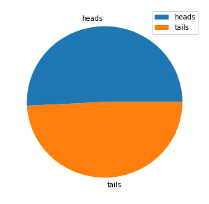
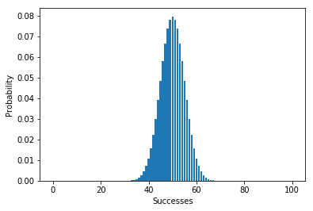
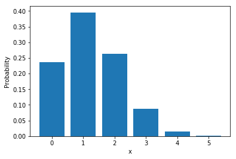
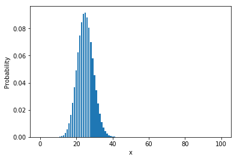

# Probability
Many of the problems we try to solve using statistics are to do with *probability*. For example, what's the probable salary for a graduate who scored a given score in their final exam at school? Or, what's the likely height of a child given the height of his or her parents?

It therefore makes sense to learn some basic principles of probability as we study statistics.

## Probability Basics
Let's start with some basic definitions and principles.
- An **experiment** or **trial** is an action with an uncertain outcome, such as tossing a coin.
- A **sample space** is the set of all possible outcomes of an experiment. In a coin toss, there's a set of two possible oucomes (*heads* and *tails*).
- A **sample point** is a single possible outcome - for example, *heads*)
- An **event** is a specific outome of single instance of an experiment - for example, tossing a coin and getting *tails*.
- **Probability** is a value between 0 and 1 that indicates the likelihood of a particular event, with 0 meaning that the event is impossible, and 1 meaning that the event is inevitable. In general terms, it's calculated like this:

$$
\text{probability of an event} = \frac{\text{Number of sample points that produce the event}}{\text{Total number of sample points in the sample space}}
$$

For example, the probability of getting *heads* when tossing as coin is <sup>1</sup>/<sub>2</sub> - there is only one side of the coin that is designated *heads*. and there are two possible outcomes in the sample space (*heads* and *tails*). So the probability of getting *heads* in a single coin toss is 0.5 (or 50% when expressed as a percentage).

Let's look at another example. Suppose you throw two dice, hoping to get 7.

The dice throw itself is an *experiment* - you don't know the outome until the dice have landed and settled.

The *sample space* of all possible outcomes is every combination of two dice - 36 *sample points*:
<table style='font-size:36px;'>
<tr><td>&#9856;+&#9856;</td><td>&#9856;+&#9857;</td><td>&#9856;+&#9858;</td><td>&#9856;+&#9859;</td><td>&#9856;+&#9860;</td><td>&#9856;+&#9861;</td></tr>
<tr><td>&#9857;+&#9856;</td><td>&#9857;+&#9857;</td><td>&#9857;+&#9858;</td><td>&#9857;+&#9859;</td><td>&#9857;+&#9860;</td><td>&#9857;+&#9861;</td></tr>
<tr><td>&#9858;+&#9856;</td><td>&#9858;+&#9857;</td><td>&#9858;+&#9858;</td><td>&#9858;+&#9859;</td><td>&#9858;+&#9860;</td><td>&#9858;+&#9861;</td></tr>
<tr><td>&#9859;+&#9856;</td><td>&#9859;+&#9857;</td><td>&#9859;+&#9858;</td><td>&#9859;+&#9859;</td><td>&#9859;+&#9860;</td><td>&#9859;+&#9861;</td></tr>
<tr><td>&#9860;+&#9856;</td><td>&#9860;+&#9857;</td><td>&#9860;+&#9858;</td><td>&#9860;+&#9859;</td><td>&#9860;+&#9860;</td><td>&#9860;+&#9861;</td></tr>
<tr><td>&#9861;+&#9856;</td><td>&#9861;+&#9857;</td><td>&#9861;+&#9858;</td><td>&#9861;+&#9859;</td><td>&#9861;+&#9860;</td><td>&#9861;+&#9861;</td></tr>
</table>

The *event* you want to happen is throwing a 7. There are 6 *sample points* that could produce this event:

<table style='font-size:36px;'>
<tr><td style='color:lightgrey;'>&#9856;+&#9856;</td><td style='color:lightgrey;'>&#9856;+&#9857;</td><td style='color:lightgrey;'>&#9856;+&#9858;</td><td style='color:lightgrey;'>&#9856;+&#9859;</td><td style='color:lightgrey;'>&#9856;+&#9860;</td><td>&#9856;+&#9861;</td></tr>
<tr><td style='color:lightgrey;'>&#9857;+&#9856;</td><td style='color:lightgrey;'>&#9857;+&#9857;</td><td style='color:lightgrey;'>&#9857;+&#9858;</td><td style='color:lightgrey;'>&#9857;+&#9859;</td><td>&#9857;+&#9860;</td><td style='color:lightgrey;'>&#9857;+&#9861;</td></tr>
<tr><td style='color:lightgrey;'>&#9858;+&#9856;</td><td style='color:lightgrey;'>&#9858;+&#9857;</td><td style='color:lightgrey;'>&#9858;+&#9858;</td><td>&#9858;+&#9859;</td><td style='color:lightgrey;'>&#9858;+&#9860;</td><td style='color:lightgrey;'>&#9858;+&#9861;</td></tr>
<tr><td style='color:lightgrey;'>&#9859;+&#9856;</td><td style='color:lightgrey;'>&#9859;+&#9857;</td><td>&#9859;+&#9858;</td><td style='color:lightgrey;'>&#9859;+&#9859;</td><td style='color:lightgrey;'>&#9859;+&#9860;</td><td style='color:lightgrey;'>&#9859;+&#9861;</td></tr>
<tr><td style='color:lightgrey;'>&#9860;+&#9856;</td><td>&#9860;+&#9857;</td><td style='color:lightgrey;'>&#9860;+&#9858;</td><td style='color:lightgrey;'>&#9860;+&#9859;</td><td style='color:lightgrey;'>&#9860;+&#9860;</td><td style='color:lightgrey;'>&#9860;+&#9861;</td></tr>
<tr><td>&#9861;+&#9856;</td><td style='color:lightgrey;'>&#9861;+&#9857;</td><td style='color:lightgrey;'>&#9861;+&#9858;</td><td style='color:lightgrey;'>&#9861;+&#9859;</td><td style='color:lightgrey;'>&#9861;+&#9860;</td><td style='color:lightgrey;'>&#9861;+&#9861;</td></tr>
</table>

The *probability* of throwing a 7 is therefore <sup>6</sup>/<sub>36</sub> which can be simplified to <sup>1</sup>/<sub>6</sub> or approximately 0.167 (16.7%).

### Probability Notation
When we express probability, we use an upper-case **P** to indicate *probability* and an upper-case letter to represent the event. So to express the probability of throwing a 7 as an event valled **A**, we could write:

$$\begin{equation}P(A) = 0.167 \end{equation}$$

### The Complement of an Event
The *complement* of an event is the set of *sample points* that do **not** result in the event.

For example, suppose you have a standard deck of playing cards, and you draw one card, hoping for a *spade*. In this case, the drawing of a card is the *experiment*, and the *event* is drawing a spade. There are 13 cards of each suit in the deck. So the *sample space* contains 52 *sample points*:

<table>
<tr><td>13 x <span style='font-size:32px;color:red;'>&hearts;</span></td><td>13 x <span style='font-size:32px;color:black;'>&spades;</span></td><td>13 x <span style='font-size:32px;color:black;'>&clubs;</span></td><td>13 x <span style='font-size:32px;color:red;'>&diams;</span></td></tr>
</table>

There are 13 *sample points* that would satisfy the requirements of the event:

<table>
<tr><td style='color:lightgrey;'>13 x <span style='font-size:32px;'>&hearts;</span></td><td>13 x <span style='font-size:32px;'>&spades;</span></td><td style='color:lightgrey;'>13 x <span style='font-size:32px;'>&clubs;</span></td><td style='color:lightgrey;'>13 x <span style='font-size:32px'>&diams;</span></td></tr>
</table>

So the *probability* of the event (drawing a spade) is <sup>13</sup>/<sub>52</sub> which is <sup>1</sup>/<sub>4</sub> or 0.25 (25%).

The *complement* of the event is all of the possible outcomes that *don't* result in drawing a spade:

<table>
<tr><td>13 x <span style='font-size:32px;color:red;'>&hearts;</span></td><td style='color:lightgrey;'>13 x <span style='font-size:32px;'>&spades;</span></td><td>13 x <span style='font-size:32px;color:black;'>&clubs;</span></td><td>13 x <span style='font-size:32px;color:red;'>&diams;</span></td></tr>
</table>

There are 39 sample points in the complement (3 x 13), so the probability of the complement is <sup>39</sup>/<sub>52</sub> which is <sup>3</sup>/<sub>4</sub> or 0.75 (75%).

Note that the probability of an event and the probability of its complement **always add up to 1**.

This fact can be useful in some cases. For example, suppose you throw two dice and want to know the probability of throwing more than 4. You *could* count all of the outcomes that would produce this result, but there are a lot of them. It might be easier to identify the ones that *do not* produce this result (in other words, the complement):

<table style='font-size:36px;'>
<tr><td>&#9856;+&#9856;</td><td>&#9856;+&#9857;</td><td>&#9856;+&#9858;</td><td style='color:lightgrey;'>&#9856;+&#9859;</td><td style='color:lightgrey;'>&#9856;+&#9860;</td><td style='color:lightgrey;'>&#9856;+&#9861;</td></tr>
<tr><td>&#9857;+&#9856;</td><td>&#9857;+&#9857;</td><td style='color:lightgrey;'>&#9857;+&#9858;</td><td style='color:lightgrey;'>&#9857;+&#9859;</td><td style='color:lightgrey;'>&#9857;+&#9860;</td><td style='color:lightgrey;'>&#9857;+&#9861;</td></tr>
<tr><td>&#9858;+&#9856;</td><td style='color:lightgrey;'>&#9858;+&#9857;</td><td style='color:lightgrey;'>&#9858;+&#9858;</td><td style='color:lightgrey;'>&#9858;+&#9859;</td><td style='color:lightgrey;'>&#9858;+&#9860;</td><td style='color:lightgrey;'>&#9858;+&#9861;</td></tr>
<tr><td style='color:lightgrey;'>&#9859;+&#9856;</td><td style='color:lightgrey;'>&#9859;+&#9857;</td><td style='color:lightgrey;'>&#9859;+&#9858;</td><td style='color:lightgrey;'>&#9859;+&#9859;</td><td style='color:lightgrey;'>&#9859;+&#9860;</td><td style='color:lightgrey;'>&#9859;+&#9861;</td></tr>
<tr><td style='color:lightgrey;'>&#9860;+&#9856;</td><td style='color:lightgrey;'>&#9860;+&#9857;</td><td style='color:lightgrey;'>&#9860;+&#9858;</td><td style='color:lightgrey;'>&#9860;+&#9859;</td><td style='color:lightgrey;'>&#9860;+&#9860;</td><td style='color:lightgrey;'>&#9860;+&#9861;</td></tr>
<tr><td style='color:lightgrey;'>&#9861;+&#9856;</td><td style='color:lightgrey;'>&#9861;+&#9857;</td><td style='color:lightgrey;'>&#9861;+&#9858;</td><td style='color:lightgrey;'>&#9861;+&#9859;</td><td style='color:lightgrey;'>&#9861;+&#9860;</td><td style='color:lightgrey;'>&#9861;+&#9861;</td></tr>
</table>

Out of a total of 36 sample points in the sample space, there are 6 sample points where you throw a 4 or less (1+1, 1+2, 1+3, 2+1, 2+2, and 3+1); so the probability of the complement is <sup>6</sup>/<sub>36</sub> which is <sup>1</sup>/<sub>6</sub> or approximately 0.167 (16.7%).

Now, here's the clever bit. Since the probability of the complement and the event itself must add up to 1, the probability of the event must be **<sup>5</sup>/<sub>6</sub>** or **0.833** (**83.3%**).

We indicate the complement of an event by adding a **'** to the letter assigned to it, so:

$$\begin{equation}P(A) = 1 - P(A') \end{equation}$$

### Bias
Often, the sample points in the sample space do not have the same probability, so there is a *bias* that makes one outcome more likely than another. For example, suppose your local weather forecaster indicates the predominant weather for each day of the week like this:

<table>
<tr><td style='text-align:center'>Mon</td><td style='text-align:center'>Tue</td><td style='text-align:center'>Wed</td><td style='text-align:center'>Thu</td><td style='text-align:center'>Fri</td><td style='text-align:center'>Sat</td><td style='text-align:center'>Sun</td></tr>
<tr style='font-size:32px'><td>&#9729;</td><td>&#9730;</td><td>&#9728;</td><td>&#9728;</td><td>&#9728;</td><td>&#9729;</td><td>&#9728;</td></tr>
</table>

This forceast is pretty typical for your area at this time of the year. In fact, historically the weather is sunny on 60% of days, cloudy on 30% of days, and rainy on only 10% of days. On any given day, the sample space for the weather contains 3 sample points (*sunny*, *cloudy*, and *rainy*); but the probabilities for these sample points are not the same.

If we assign the letter __A__ to a sunny day event, __B__ to a cloudy day event, and __C__ to a rainy day event then we can write these probabilities like this:

$$\begin{equation}P(A)=0.6\;\;\;\; P(B)=0.3\;\;\;\; P(C)=0.1 \end{equation}$$

The complement of __A__ (a sunny day) is any day where it is not sunny - it is either cloudy or rainy. We can work out the probability for this in two ways: we can subtract the probablity of **A** from 1:

$$\begin{equation}P(A') = 1 - P(A) = 1 - 0.6 = 0.4 \end{equation}$$

Or we can add together the probabilities for all events that do *not* result in a sunny day:

$$\begin{equation}P(A') = P(B) + P(C) = 0.3 + 0.1 = 0.4 \end{equation}$$

Either way, there's a 40% chance of it not being sunny!


## Conditional Probability and Dependence
Events can be:
- *Independent* (events that are not affected by other events)
- *Dependent* (events that are conditional on other events)
- *Mutually Exclusive* (events that can't occur together)

### Independent Events
Imagine you toss a coin. The sample space contains two possible outomes: heads (<span style='font-size:42px;color:gold;'><sub>&#10050;</sub></span>) or tails (<span style='font-size:42px;color:gold;'><sub>&#9854;</sub></span>).

The probability of getting *heads* is <sup>1</sup>/<sub>2</sub>, and the probability of getting *tails* is also <sup>1</sup>/<sub>2</sub>. Let's toss a coin...

<span style='font-size:48px;color:gold;'>&#10050;</span>

OK, so we got *heads*. Now, let's toss the coin again:

<span style='font-size:48px;color:gold;'>&#10050;</span>

It looks like we got *heads* again. If we were to toss the coin a third time, what's the probability that we'd get *heads*?

Although you might be tempted to think that a *tail* is overdue, the fact is that each coin toss is an independent event. The outcome of the first coin toss does not affect the second coin toss (or the third, or any number of other coin tosses). For each independent coin toss, the probability of getting *heads* (or *tails*) remains <sup>1</sup>/<sub>2</sub>, or 50%.

Run the following Python code to simulate 10,000 coin tosses by assigning a random value of 0 or 1 to *heads* and *tails*. Each time the coin is tossed, the probability of getting *heads* or *tails* is 50%, so you should expect approximately half of the results to be *heads* and half to be *tails* (it won't be exactly half, due to a little random variation; but it should be close):


```python
%matplotlib inline
import random

# Create a list with 2 element (for heads and tails)
heads_tails = [0,0]

# loop through 10000 trials
trials = 10000
trial = 0
while trial < trials:
    trial = trial + 1
    # Get a random 0 or 1
    toss = random.randint(0,1)
    # Increment the list element corresponding to the toss result
    heads_tails[toss] = heads_tails[toss] + 1

print (heads_tails)

# Show a pie chart of the results
from matplotlib import pyplot as plt
plt.figure(figsize=(5,5))
plt.pie(heads_tails, labels=['heads', 'tails'])
plt.legend()
plt.show()
```

    [5082, 4918]





### Combining Independent Events
Now, let's ask a slightly different question. What is the probability of getting three *heads* in a row? Since the probability of a heads on each independent toss is <sup>1</sup>/<sub>2</sub>, you might be tempted to think that the same probability applies to getting three *heads* in a row; but actually, we need to treat getting three *heads* as it's own event, which is the combination of three independent events. To combine independent events like this, we need to multiply the probability of each event. So:

<span style='font-size:48px;color:gold;'><sub>&#10050;</sub></span> = <sup>1</sup>/<sub>2</sub>

<span style='font-size:48px;color:gold;'><sub>&#10050;&#10050;</sub></span> = <sup>1</sup>/<sub>2</sub> x <sup>1</sup>/<sub>2</sub>

<span style='font-size:48px;color:gold;'><sub>&#10050;&#10050;&#10050;</sub></span> = <sup>1</sup>/<sub>2</sub> x <sup>1</sup>/<sub>2</sub> x <sup>1</sup>/<sub>2</sub>

So the probability of tossing three *heads* in a row is 0.5 x 0.5 x 0.5, which is 0.125 (or 12.5%).

Run the code below to simulate 10,000 trials of flipping a coin three times:


```python
import random

# Count the number of 3xHeads results
h3 = 0

# Create a list of all results
results = []

# loop through 10000 trials
trials = 10000
trial = 0
while trial < trials:
    trial = trial + 1
    # Flip three coins
    result = ['H' if random.randint(0,1) == 1 else 'T',
              'H' if random.randint(0,1) == 1 else 'T',
              'H' if random.randint(0,1) == 1 else 'T']
    results.append(result)
    # If it's three heads, add it to the count
    h3 = h3 + int(result == ['H','H','H'])
    
# What proportion of trials produced 3x heads
print ("%.2f%%" % ((h3/trials)*100))

# Show all the results
print (results)

```

    12.56%


The output shows the percentage of times a trial resulted in three heads (which should be somewhere close to 12.5%). You can count the number of *['H', 'H', 'H']* entries in the full list of results to verify this if you like!


#### Probability Trees
You can represent a series of events and their probabilities as a probability tree:

                         ____H(0.5)  : 0.5 x 0.5 x 0.5 = 0.125
                        /
                   ____H(0.5)
                  /     \____T(0.5)  : 0.5 x 0.5 x 0.5 = 0.125
                 /        
              __H(0.5)   ____H(0.5)  : 0.5 x 0.5 x 0.5 = 0.125
             /   \      / 
            /     \____T(0.5)
           /            \____T(0.5)  : 0.5 x 0.5 x 0.5 = 0.125
          /              
    _____/              _____H(0.5)  : 0.5 x 0.5 x 0.5 = 0.125
         \             / 
          \        ___H(0.5)
           \      /    \_____T(0.5)  : 0.5 x 0.5 x 0.5 = 0.125
            \    /       
             \__T(0.5)  _____H(0.5)  : 0.5 x 0.5 x 0.5 = 0.125
                 \     /
                  \___T(0.5)
                       \_____T(0.5)  : 0.5 x 0.5 x 0.5 = 0.125
                                                         _____
                                                          1.0

Starting at the left, you can follow the branches in the tree that represent each event (in this case a coin toss result of *heads* or *tails* at each branch). Multiplying the probability of each branch of your path through the tree gives you the combined probability for an event composed of all of the events in the path. In this case, you can see from the tree that you are equally likely to get any sequence of three *heads* or *tails* results (so three *heads* is just as likely as three *tails*, which is just as likely as *head-tail-head*, *tail-head-tail*, or any other combination!)

Note that the total probability for all paths through the tree adds up to 1.

#### Combined Event Probability Notation
When calculating the probability of combined events, we assign a letter such as **A** or **B** to each event, and we use the *intersection* (**&cap;**) symbol to indicate that we want the combined probability of multiple events. So we could assign the letters **A**, **B**, and **C** to each independent coin toss in our sequence of three tosses, and express the combined probability like this:

$$\begin{equation}P(A \cap B \cap C) = P(A) \times P(B) \times P(C) \end{equation}$$

#### Combining Events with Different Probabilities
Imagine you have created a new game that mixes the excitement of coin-tossing with the thrill of die-rolling! The objective of the game is to roll a die and get *6*, and toss a coin and get *heads*:

<div style='text-align:center'><span style='font-size:48px;'>&#9861;</span><span style='font-size:42px;'> +</span><span style='font-size:48px;color:gold;'>&#10050;</span></div>

On each turn of the game, a player rolls the die and tosses the coin.

How can we calculate the probability of winning?

There are two independent events required to win: a die-roll of *6* (which we'll call event **A**), and a coin-toss of *heads* (which we'll call event **B**)

Our formula for combined independent events is:

$$\begin{equation}P(A \cap B) = P(A) \times P(B) \end{equation}$$

The probability of rolling a *6* on a fair die is <sup>1</sup>/<sub>6</sub> or 0.167;  and the probability of tossing a coin and getting *heads* is <sup>1</sup>/<sub>2</sub> or 0.5:

$$\begin{equation}P(A \cap B) = 0.167 \times 0.5 = 0.083 \end{equation}$$

So on each turn, there's an 8.3% chance to win the game.

#### Intersections and Unions

Previously you saw that we use the *intersection* (**&cap;**) symbol to represent "and" when combining event probabilities. This notation comes from a branch of mathematics called *set theory*, in which we work with sets of values. let's examine this in a little more detail.

Here's our deck of playing cards, with the full sample space for drawing any card:

<table style='font-size:18px;'>
<tr><td style='color:red;'>A &hearts;</td><td style='color:black;'>A &spades;</td><td style='color:black;'>A &clubs;<td style='color:red;'>A &diams;</td></tr>
<tr><td style='color:red;'>K &hearts;</td><td style='color:black;'>K &spades;</td><td style='color:black;'>K &clubs;<td style='color:red;'>K &diams;</td></tr>
<tr><td style='color:red;'>Q &hearts;</td><td style='color:black;'>Q &spades;</td><td style='color:black;'>Q &clubs;<td style='color:red;'>Q &diams;</td></tr>
<tr><td style='color:red;'>J &hearts;</td><td style='color:black;'>J &spades;</td><td style='color:black;'>J &clubs;<td style='color:red;'>J &diams;</td></tr>
<tr><td style='color:red;'>10 &hearts;</td><td style='color:black;'>10 &spades;</td><td style='color:black;'>10 &clubs;<td style='color:red;'>10 &diams;</td></tr>
<tr><td style='color:red;'>9 &hearts;</td><td style='color:black;'>9 &spades;</td><td style='color:black;'>9 &clubs;<td style='color:red;'>9 &diams;</td></tr>
<tr><td style='color:red;'>8 &hearts;</td><td style='color:black;'>8 &spades;</td><td style='color:black;'>8 &clubs;<td style='color:red;'>8 &diams;</td></tr>
<tr><td style='color:red;'>7 &hearts;</td><td style='color:black;'>7 &spades;</td><td style='color:black;'>7 &clubs;<td style='color:red;'>7 &diams;</td></tr>
<tr><td style='color:red;'>6 &hearts;</td><td style='color:black;'>6 &spades;</td><td style='color:black;'>6 &clubs;<td style='color:red;'>6 &diams;</td></tr>
<tr><td style='color:red;'>5 &hearts;</td><td style='color:black;'>5 &spades;</td><td style='color:black;'>5 &clubs;<td style='color:red;'>5 &diams;</td></tr>
<tr><td style='color:red;'>4 &hearts;</td><td style='color:black;'>4 &spades;</td><td style='color:black;'>4 &clubs;<td style='color:red;'>4 &diams;</td></tr>
<tr><td style='color:red;'>3 &hearts;</td><td style='color:black;'>3 &spades;</td><td style='color:black;'>3 &clubs;<td style='color:red;'>3 &diams;</td></tr>
<tr><td style='color:red;'>2 &hearts;</td><td style='color:black;'>2 &spades;</td><td style='color:black;'>2 &clubs;<td style='color:red;'>2 &diams;</td></tr>
</table>

Now, let's look at two potential events:
- Drawing an ace (**A**)
- Drawing a red card (**B**)

The set of sample points for event **A** (drawing an ace) is:

<table style='font-size:18px;'>
<tr><td style='color:red;'>A &hearts;</td><td style='color:black;'>A &spades;</td><td style='color:black;'>A &clubs;<td style='color:red;'>A &diams;</td></tr>
<tr style='color:lightgrey;'><td>K &hearts;</td><td style='color:lightgrey;'>K &spades;</td><td style='color:lightgrey;'>K &clubs;<td>K &diams;</td></tr>
<tr style='color:lightgrey;'><td>Q &hearts;</td><td>Q &spades;</td><td>Q &clubs;<td>Q &diams;</td></tr>
<tr style='color:lightgrey;'><td>J &hearts;</td><td>J &spades;</td><td>J &clubs;<td>J &diams;</td></tr>
<tr style='color:lightgrey;'><td>10 &hearts;</td><td>10 &spades;</td><td>10 &clubs;<td>10 &diams;</td></tr>
<tr style='color:lightgrey;'><td>9 &hearts;</td><td>9 &spades;</td><td>9 &clubs;<td>9 &diams;</td></tr>
<tr style='color:lightgrey;'><td>8 &hearts;</td><td>8 &spades;</td><td>8 &clubs;<td>8 &diams;</td></tr>
<tr style='color:lightgrey;'><td>7 &hearts;</td><td>7 &spades;</td><td>7 &clubs;<td>7 &diams;</td></tr>
<tr style='color:lightgrey;'><td>6 &hearts;</td><td>6 &spades;</td><td>6 &clubs;<td>6 &diams;</td></tr>
<tr style='color:lightgrey;'><td>5 &hearts;</td><td>5 &spades;</td><td>5 &clubs;<td>5 &diams;</td></tr>
<tr style='color:lightgrey;'><td>4 &hearts;</td><td>4 &spades;</td><td>4 &clubs;<td>4 &diams;</td></tr>
<tr style='color:lightgrey;'><td>3 &hearts;</td><td>3 &spades;</td><td>3 &clubs;<td>3 &diams;</td></tr>
<tr style='color:lightgrey;'><td>2 &hearts;</td><td>2 &spades;</td><td>2 &clubs;<td>2 &diams;</td></tr>
</table>

So the probability of drawing an ace is:

$$\begin{equation}P(A) = \frac{4}{52} = \frac{1}{13} = 0.077\end{equation} $$

Now let's look at the set of sample points for event **B** (drawing a red card)

<table style='font-size:18px;'>
<tr><td style='color:red;'>A &hearts;</td><td style='color:lightgrey;'>A &spades;</td><td style='color:lightgrey;'>A &clubs;<td style='color:red;'>A &diams;</td></tr>
<tr><td style='color:red;'>K &hearts;</td><td style='color:lightgrey;'>K &spades;</td><td style='color:lightgrey;'>K &clubs;<td style='color:red;'>K &diams;</td></tr>
<tr><td style='color:red;'>Q &hearts;</td><td style='color:lightgrey;'>Q &spades;</td><td style='color:lightgrey;'>Q &clubs;<td style='color:red;'>Q &diams;</td></tr>
<tr><td style='color:red;'>J &hearts;</td><td style='color:lightgrey;'>J &spades;</td><td style='color:lightgrey;'>J &clubs;<td style='color:red;'>J &diams;</td></tr>
<tr><td style='color:red;'>10 &hearts;</td><td style='color:lightgrey;'>10 &spades;</td><td style='color:lightgrey;'>10 &clubs;<td style='color:red;'>10 &diams;</td></tr>
<tr><td style='color:red;'>9 &hearts;</td><td style='color:lightgrey;'>9 &spades;</td><td style='color:lightgrey;'>9 &clubs;<td style='color:red;'>9 &diams;</td></tr>
<tr><td style='color:red;'>8 &hearts;</td><td style='color:lightgrey;'>8 &spades;</td><td style='color:lightgrey;'>8 &clubs;<td style='color:red;'>8 &diams;</td></tr>
<tr><td style='color:red;'>7 &hearts;</td><td style='color:lightgrey;'>7 &spades;</td><td style='color:lightgrey;'>7 &clubs;<td style='color:red;'>7 &diams;</td></tr>
<tr><td style='color:red;'>6 &hearts;</td><td style='color:lightgrey;'>6 &spades;</td><td style='color:lightgrey;'>6 &clubs;<td style='color:red;'>6 &diams;</td></tr>
<tr><td style='color:red;'>5 &hearts;</td><td style='color:lightgrey;'>5 &spades;</td><td style='color:lightgrey;'>5 &clubs;<td style='color:red;'>5 &diams;</td></tr>
<tr><td style='color:red;'>4 &hearts;</td><td style='color:lightgrey;'>4 &spades;</td><td style='color:lightgrey;'>4 &clubs;<td style='color:red;'>4 &diams;</td></tr>
<tr><td style='color:red;'>3 &hearts;</td><td style='color:lightgrey;'>3 &spades;</td><td style='color:lightgrey;'>3 &clubs;<td style='color:red;'>3 &diams;</td></tr>
<tr><td style='color:red;'>2 &hearts;</td><td style='color:lightgrey;'>2 &spades;</td><td style='color:lightgrey;'>2 &clubs;<td style='color:red;'>2 &diams;</td></tr>
</table>

The probability of drawing a red card is therefore:

$$\begin{equation}P(A) = \frac{26}{52} = \frac{1}{2} = 0.5\end{equation} $$

##### Intersections

We can think of the sample spaces for these events as two sets, and we can show them as a Venn diagram:

<br/>

<div style='text-align:center'>Event A<span style='font-size:120px'>&#9901;</span>Event B</div>

Each circle in the Venn diagram represents a set of sample points. The set on the left contains the sample points for event **A** (drawing an ace) and the set on the right contains the sample points for event **B** (drawing a red card). Note that the circles overlap, creating an intersection that contains only the sample points that apply to event **A** *and* event **B**.

This intersected sample space looks like this:

<table style='font-size:18px;'>
<tr><td style='color:red;'>A &hearts;</td><td style='color:lightgrey;'>A &spades;</td><td style='color:lightgrey;'>A &clubs;<td style='color:red;'>A &diams;</td></tr>
<tr style='color:lightgrey;'><td>K &hearts;</td><td style='color:lightgrey;'>K &spades;</td><td style='color:lightgrey;'>K &clubs;<td>K &diams;</td></tr>
<tr style='color:lightgrey;'><td>Q &hearts;</td><td>Q &spades;</td><td>Q &clubs;<td>Q &diams;</td></tr>
<tr style='color:lightgrey;'><td>J &hearts;</td><td>J &spades;</td><td>J &clubs;<td>J &diams;</td></tr>
<tr style='color:lightgrey;'><td>10 &hearts;</td><td>10 &spades;</td><td>10 &clubs;<td>10 &diams;</td></tr>
<tr style='color:lightgrey;'><td>9 &hearts;</td><td>9 &spades;</td><td>9 &clubs;<td>9 &diams;</td></tr>
<tr style='color:lightgrey;'><td>8 &hearts;</td><td>8 &spades;</td><td>8 &clubs;<td>8 &diams;</td></tr>
<tr style='color:lightgrey;'><td>7 &hearts;</td><td>7 &spades;</td><td>7 &clubs;<td>7 &diams;</td></tr>
<tr style='color:lightgrey;'><td>6 &hearts;</td><td>6 &spades;</td><td>6 &clubs;<td>6 &diams;</td></tr>
<tr style='color:lightgrey;'><td>5 &hearts;</td><td>5 &spades;</td><td>5 &clubs;<td>5 &diams;</td></tr>
<tr style='color:lightgrey;'><td>4 &hearts;</td><td>4 &spades;</td><td>4 &clubs;<td>4 &diams;</td></tr>
<tr style='color:lightgrey;'><td>3 &hearts;</td><td>3 &spades;</td><td>3 &clubs;<td>3 &diams;</td></tr>
<tr style='color:lightgrey;'><td>2 &hearts;</td><td>2 &spades;</td><td>2 &clubs;<td>2 &diams;</td></tr>
</table>

As you've seen previously, we write this as **A &cap; B**, and we can calculate its probability like this:

$$\begin{equation}P(A \cap B) = P(A) \times P(B) = 0.077 \times 0.5 = 0.0385 \end{equation}$$

So when you draw a single card from a full deck, there is a 3.85% chance it will be a red ace.

##### Unions
The intersection describes the sample space for  event **A** *and* event **B**; but what if we wanted to look at the probability of drawing an ace *or* a red card. In other words, any sample point that is in either of the Venn digram circles.

This set of sample points looks like this:

<table style='font-size:18px;'>
<tr><td style='color:red;'>A &hearts;</td><td style='color:black;'>A &spades;</td><td style='color:black;'>A &clubs;<td style='color:red;'>A &diams;</td></tr>
<tr><td style='color:red;'>K &hearts;</td><td style='color:lightgrey;'>K &spades;</td><td style='color:lightgrey;'>K &clubs;<td style='color:red;'>K &diams;</td></tr>
<tr><td style='color:red;'>Q &hearts;</td><td style='color:lightgrey;'>Q &spades;</td><td style='color:lightgrey;'>Q &clubs;<td style='color:red;'>Q &diams;</td></tr>
<tr><td style='color:red;'>J &hearts;</td><td style='color:lightgrey;'>J &spades;</td><td style='color:lightgrey;'>J &clubs;<td style='color:red;'>J &diams;</td></tr>
<tr><td style='color:red;'>10 &hearts;</td><td style='color:lightgrey;'>10 &spades;</td><td style='color:lightgrey;'>10 &clubs;<td style='color:red;'>10 &diams;</td></tr>
<tr><td style='color:red;'>9 &hearts;</td><td style='color:lightgrey;'>9 &spades;</td><td style='color:lightgrey;'>9 &clubs;<td style='color:red;'>9 &diams;</td></tr>
<tr><td style='color:red;'>8 &hearts;</td><td style='color:lightgrey;'>8 &spades;</td><td style='color:lightgrey;'>8 &clubs;<td style='color:red;'>8 &diams;</td></tr>
<tr><td style='color:red;'>7 &hearts;</td><td style='color:lightgrey;'>7 &spades;</td><td style='color:lightgrey;'>7 &clubs;<td style='color:red;'>7 &diams;</td></tr>
<tr><td style='color:red;'>6 &hearts;</td><td style='color:lightgrey;'>6 &spades;</td><td style='color:lightgrey;'>6 &clubs;<td style='color:red;'>6 &diams;</td></tr>
<tr><td style='color:red;'>5 &hearts;</td><td style='color:lightgrey;'>5 &spades;</td><td style='color:lightgrey;'>5 &clubs;<td style='color:red;'>5 &diams;</td></tr>
<tr><td style='color:red;'>4 &hearts;</td><td style='color:lightgrey;'>4 &spades;</td><td style='color:lightgrey;'>4 &clubs;<td style='color:red;'>4 &diams;</td></tr>
<tr><td style='color:red;'>3 &hearts;</td><td style='color:lightgrey;'>3 &spades;</td><td style='color:lightgrey;'>3 &clubs;<td style='color:red;'>3 &diams;</td></tr>
<tr><td style='color:red;'>2 &hearts;</td><td style='color:lightgrey;'>2 &spades;</td><td style='color:lightgrey;'>2 &clubs;<td style='color:red;'>2 &diams;</td></tr>
</table>

We call this the *union* of the sets, and we write it as **A &cup; B**.

To calculate the probability of a card being either an ace (of any color) or a red card (of any value), we can work out the probability of A, add it to the probability of B, and subtract the probability of A &cap; B (to avoid double-counting the red aces):

$$\begin{equation}P(A \cup B) = P(A) + P(B) - P(A \cap B)\end{equation}$$

So:

$$\begin{equation}P(A \cup B) = 0.077 + 0.5 - 0.0385 = 0.5385\end{equation}$$

So when you draw a card from a full deck, there is a 53.85% probability that it will be either an ace or a red card.

### Dependent Events
Let's return to our deck of 52 cards from which we're going to draw one card. The sample space can be summarized like this:

<table>
<tr><td>13 x <span style='font-size:32px;color:red;'>&hearts;</span></td><td>13 x <span style='font-size:32px;color:black;'>&spades;</span></td><td>13 x <span style='font-size:32px;color:black;'>&clubs;</span></td><td>13 x <span style='font-size:32px;color:red;'>&diams;</span></td></tr>
</table>

There are two black suits (*spades* and *clubs*) and two red suits (*hearts* and *diamonds*); with 13 cards in each suit. So the probability of drawing a black card (event **A**) and the probability of drawing a red card (event **B**) can be calculated like this:

$$\begin{equation}P(A) = \frac{13 + 13}{52} = \frac{26}{52} = 0.5 \;\;\;\; P(B) = \frac{13 + 13}{52} = \frac{26}{52} = 0.5\end{equation}$$

Now let's draw a card from the deck:

<div style ='text-align:center;'><span style='font-size:32px;color:red;'>&hearts;</span></div>

We drew a heart, which is red. So, assuming we don't replace the card back into the deck, this changes the sample space as follows:

<table>
<tr><td>12 x <span style='font-size:32px;color:red;'>&hearts;</span></td><td>13 x <span style='font-size:32px;color:black;'>&spades;</span></td><td>13 x <span style='font-size:32px;color:black;'>&clubs;</span></td><td>13 x <span style='font-size:32px;color:red;'>&diams;</span></td></tr>
</table>

The probabilities for **A** and **B** are now:

$$\begin{equation}P(A) = \frac{13 + 13}{51} = \frac{26}{51} = 0.51 \;\;\;\; P(B) = \frac{12 + 13}{51} = \frac{25}{51} = 0.49\end{equation}$$

Now let's draw a second card:

<div style ='text-align:center;'><span style='font-size:32px;color:red;'>&diams;</span></div>

We drew a diamond, so again this changes the sample space for the next draw:

<table>
<tr><td>12 x <span style='font-size:32px;color:red;'>&hearts;</span></td><td>13 x <span style='font-size:32px;color:black;'>&spades;</span></td><td>13 x <span style='font-size:32px;color:black;'>&clubs;</span></td><td>12 x <span style='font-size:32px;color:red;'>&diams;</span></td></tr>
</table>

The probabilities for **A** and **B** are now:

$$\begin{equation}P(A) = \frac{13 + 13}{50} = \frac{26}{50} = 0.52 \;\;\;\; P(B) = \frac{12 + 12}{50} = \frac{24}{50} = 0.48\end{equation}$$

So it's clear that one event can affect another; in this case, the probability of drawing a card of a particular color on the second draw depends on the color of card drawn on the previous draw. We call these *dependent* events.

Probability trees are particularly useful when looking at dependent events. Here's a probability tree for drawing red or black cards as the first three draws from a deck of cards:

                         _______R(0.48) 
                        /
                   ____R(0.49)
                  /     \_______B(0.52) 
                 /        
              __R(0.50)  _______R(0.50) 
             /   \      / 
            /     \____B(0.51)
           /            \_______B(0.50) 
          /              
    _____/              ________R(0.50) 
         \             / 
          \        ___R(0.51)
           \      /    \________B(0.50) 
            \    /       
             \__B(0.50) ________R(0.52) 
                 \     /
                  \___B(0.49)
                       \________B(0.48) 


#### Calculating Probabilities for Dependent Events
Imagine a game in which you have to predict the color of the next card to be drawn. Suppose the first card drawn is a *spade*, which is black. What is the probability of the next card being red?

The notation for this is:

$$\begin{equation}P(B|A)\end{equation}$$

You can interpret this as *the probability of B, given A*. In other words, given that event **A** (drawing a black card) has already happened, what is the probability of **B** (drawing a red card). This is commonly referred to as the *conditional probability* of B given A; and it's formula is:

$$\begin{equation}P(B|A) = \frac{P(A \cap B)}{P(A)}\end{equation}$$

So to return to our example, the probability of the second card being red given that the first card was black is:

$$\begin{equation}P(B|A) = \frac{\frac{26}{52} \times \frac{26}{51}}{\frac{26}{52}}\end{equation}$$

Which simplifies to:

$$\begin{equation}P(B|A) = \frac{0.5 \times 0.51}{0.5}\end{equation}$$

So:

$$\begin{equation}P(B|A) = \frac{0.255}{0.5} = 0.51\end{equation}$$

Which is what we calculated previously - so the formula works!

Because this is an algebraic expression, we can rearrange it like this:

$$\begin{equation}P(A \cap B) = P(A) \times P(B|A)\end{equation}$$

We can use this form of the formula to calculate the probability that the first two cards drawn from a full deck of cards will both be jacks. In this case, event **A** is drawing a jack for the first card, and event **B** is drawing a jack for the second card.

The probability that the first drawn card will be a jack is:

$$\begin{equation}P(A) = \frac{4}{52} = \frac{1}{13}\end{equation}$$

We draw the first card:

<br/>
<div style ='text-align:center;'><span style='font-size:32px;color:black;'>J &clubs;</span></div>

Success! it's the jack of clubs. Our chances of the first two cards being jacks are looking good so far

Now. we know that there are now only 3 jacks left, in a deck of 51 remaining cards; so the probability of drawing a jack as a second card, given that we drew a jack as the first card is:

$$\begin{equation}P(B|A) = \frac{3}{51}\end{equation}$$

So we can work out the probability of drawing two jacks from a deck like this:

$$\begin{equation}P(A \cap B) = \frac{1}{13} \times \frac{3}{51} = \frac{3}{663} = \frac{1}{221}\end{equation}$$

So there's a 1 in 221 (0.45%)  probability that the first two cards drawn from a full deck will be jacks.


### Mutually Exclusive Events
We've talked about dependent and independent events, but there's a third category to be considered: mutually exclusive events.

For example, when flipping a coin, what is the probability that in a single coin flip the result will be *heads* ***and*** *tails*? The answer is of course, 0; a single coin flip can only result in *heads* ***or*** *tails*; not both!

For mutually exclusive event, the probability of an intersection is:

$$\begin{equation}P(A \cap B) = 0\end{equation}$$

The probability for a union is:

$$\begin{equation}P(A \cup B) = P(A) + P(B)\end{equation}$$

Note that we don't need to subtract the intersection (*and*) probability to calculate the union (*or*) probability like we did previously, because there's no risk of double-counting the sample points that lie in both events - there are none. (The intersection probability for mutually exclusive events is always 0, so you can subtract it if you like - you'll still get the same result!)

Let's look at another two mutually exclusive events based on rolling a die:
- Rolling a 6 (event **A**)
- Rolling an odd number (event **B**)

The probabilities for these events are:

$$\begin{equation}P(A) = \frac{1}{6} \;\;\;\; P(B) = \frac{3}{6}\end{equation}$$

What's the probability of rolling a 6 *and* an odd number in a single roll? These are mutually exclusive, so:

$$\begin{equation}P(A \cap B) = 0\end{equation}$$

What's the probability of rolling a 6 *or* an odd number:

$$\begin{equation}P(A \cup B) = \frac{1}{6} + \frac{3}{6} = \frac{4}{6}\end{equation}$$

## Binomial Variables and Distributions
Now that we know something about probability, let's apply that to statistics. Statistics is about inferring measures for a full population based on samples, allowing for random variation; so we're going to have to consider the idea of a *random variable*.

A random variable is a number that can vary in value. For example, the temperature on a given day, or the number of students taking a class.

### Binomial Variables
One particular type of random variable that we use in statistics is a *binomial* variable. A binomial variable is used to count how frequently an event occurs in a fixed number of repeated independent experiments. The event in question must have the same probability of occurring in each experiment, and indicates the success or failure of the experiment; with a probability ***p*** of success, which has a complement of ***1 - p*** as the probability of failure (we often call this kind of experiment a *Bernoulli Trial* after Swiss mathematician Jacob Bernoulli).

For example, suppose we flip a coin three times, counting *heads* as success. We can define a binomial variable to represent the number of successful coin flips (that is, the number of times we got *heads*).

Let's examine this in more detail.

We'll call our variable ***X***, and as stated previously it represents the number of times we flip *heads* in a series of three coin flips. Let's start by examining all the possible values for ***X***.

We're flipping the coin three times, with a probability of <sup>1</sup>/<sub>2</sub> of success on each flip. The possible results include none of the flips resulting in *heads*, all of the flips resulting in *heads*, or any combination in between. There are two possible outcomes from each flip, and there are three flips, so the total number of possible result sets is 2<sup>3</sup>, which is 8. Here they are:

<div style='font-size:48px;color:gold;'>&#9854;&#9854;&#9854;</div>
<br/>
<div style='font-size:48px;color:gold;'>&#9854;&#10050;&#9854;</div>
<br/>
<div style='font-size:48px;color:gold;'>&#9854;&#9854;&#10050;</div>
<br/>
<div style='font-size:48px;color:gold;'>&#9854;&#10050;&#10050;</div>
<br/>
<div style='font-size:48px;color:gold;'>&#10050;&#9854;&#9854;</div>
<br/>
<div style='font-size:48px;color:gold;'>&#10050;&#10050;&#9854;</div>
<br/>
<div style='font-size:48px;color:gold;'>&#10050;&#9854;&#10050;</div>
<br/>
<div style='font-size:48px;color:gold;'>&#10050;&#10050;&#10050;</div>
<br/>

In these results, our variable ***X***, representing the number of successful events (getting *heads*), can vary from 0 to 3. We can write that like this:

$$\begin{equation}X=\{0,1,2,3\}\end{equation}$$

When we want to indicate a specific outcome for a random variable, we use write the variable in lower case, for example ***x*** So what's the probability that ***x*** = 0 (meaning that out of our three flips we got no *heads*)?

We can easily see, that there is 1 row in our set of possible outcomes that contains no *heads*, so:

$$\begin{equation}P(x=0) = \frac{1}{8}\end{equation}$$

OK, let's see if we can find the probability for 1 success. There are three sample points containing a single *heads* result, so:

$$\begin{equation}P(x=1) = \frac{3}{8}\end{equation}$$

Again, we can easily see that from our results; but it's worth thinking about this in a slightly different way that will make it easier to calculate this probability more generically when there are more sample points (for example, if we had based our binomial variable on 100 coin flips, there would be many more combinations!).

What we're actually saying here is that for **3** experiments (in this case coin flips), we want to *choose* **1** successful results. This is written as <sub>3</sub>C<sub>1</sub>. More generically, this is known as *n choose k*, and it's written like this:

$$\begin{equation}_{n}C_{k}\end{equation}$$

or sometimes like this:

$$\begin{equation}\begin{pmatrix} n \\ k\end{pmatrix}\end{equation}$$

The formula to calculate this is:

$$\begin{equation}\begin{pmatrix} n \\ k\end{pmatrix} = \frac{n!}{k!(n-k)!}\end{equation}$$

The exclamation points indicate *factorials* - the product of all positive integers less than or equal to the specified integer  (with 0! having a value of 1).

In the case of our <sub>3</sub>C<sub>1</sub> calculation, this means:

$$\begin{equation}\begin{pmatrix} 3 \\ 1\end{pmatrix} = \frac{3!}{1!(3 - 1)!} = \frac{3!}{1!\times2!} =\frac{3 \times 2 \times 1}{1 \times(2 \times 1)} = \frac{6}{2} = 3 \end{equation}$$

That seems like a lot of work to find the number of successful experiments, but now that you know this general formula, you can use it to calculate the number of sample points for any value of *k* from any set of *n* cases. Let's use it to find the possibility of two successful *heads* out of 3 coin flips:

$$\begin{equation}P(x=2) = \frac{_{3}C_{2}}{8}\end{equation}$$

Let's work out the number of combinations for <sub>3</sub>C<sub>2</sub>

$$\begin{equation}_{3}C_{2} = \frac{3!}{2!(3 - 2)!} = \frac{6}{2 \times 1} = \frac{6}{2} = 3\end{equation}$$

So:

$$\begin{equation}P(x=2) = \frac{3}{8}\end{equation}$$

Finally, what's the probability that all three flips were *heads*?

$$\begin{equation}P(x=3) = \frac{_{3}C_{3}}{8}\end{equation}$$

$$\begin{equation}_{3}C_{3} = \frac{3!}{3!(3 - 3)!} = \frac{6}{6} = 1\end{equation}$$

So:

$$\begin{equation}P(x=3) = \frac{1}{8}\end{equation}$$

In Python, there are a number of modules you can use to find the *n choose k* combinations, including the *scipy.special.**comb*** function. 

In our coin flipping experiment, there is an equal probability of success and failure; so the probability calculations are relatively simple, and you may notice that there's a symmetry to the probability for each possible value of the binomial variable, as you can see by running the following Python code. You can increase the value of the **trials** variable to verify that no matter how many times we toss the coin, the probabilities of getting *heads* (or *tails* for that matter) form a symmetrical distribution, because there's an equal probability of success and failure in each trial.


```python
%matplotlib inline
from scipy import special as sps
from matplotlib import pyplot as plt
import numpy as np

trials = 100

possibilities = 2**trials
x = np.array(range(0, trials+1))

p = np.array([sps.comb(trials, i, exact=True)/possibilities for i in x])

# Set up the graph
plt.xlabel('Successes')
plt.ylabel('Probability')
plt.bar(x, p)
plt.show()
```





#### Allowing for Bias
Previously, we calculated the probability for each possible value of a random variable by simply dividing the number of combinations for that value by the total number of possible outcomes. This works if the probability of the event being tested is equal for failure and success; but of course, not all experiments have an equal chance of success or failure. Some include a bias that makes success more or less likely - so we need to be a little more thorough in our calculations to allow for this.

Suppose you're flying off to some exotic destination, and you know that there's a one in four chance that the airport security scanner will trigger a random search for each passenger that goes though. If you watch five passengers go through the scanner, how many will be stopped for a random search?

It's tempting to think that there's a one in four chance, so a quarter of the passengers will be stopped; but remember that the searches are triggered randomly for thousands of passengers that pass through the airport each day. It's possible that none of the next five passengers will be searched; all five of them will be searched, or some other value in between will be searched. 

Even though the probabilities of being searched or not searched are not the same, this is still a binomial variable. There are a fixed number of independent experiments (five passengers passing through the security scanner), the outcome of each experiment is either success (a search is triggered) or failure (no search is triggered), and the probability of being searched does not change for each passenger.

There are five experiments in which a passenger goes through the security scanner, let's call this **n**.

For each passenger, the probability of being searched is <sup>1</sup>/<sub>4</sub> or 0.25. We'll call this **p**. 

The complement of **p** (in other words, the probability of *not* being searched) is **1-p**, in this case <sup>3</sup>/<sub>4</sub> or 0.75.

So, what's the probability that out of our **n** experiments, three result in a search (let's call that **k**) and the remaining ones (there will be **n**-**k** of them, which is two) don't?

- The probability of three passengers being searched is 0.25 x 0.25 x 0.25 which is the same as 0.25<sup>3</sup>. Using our generic variables, this is **p<sup>k</sup>**.
- The probability that the rest don't get searched is 0.75 x 0.75, or 0.75<sup>2</sup>. In terms of our variables, this is **1-p<sup>(n-k)</sup>**.
- The combined probability of three searchs and two non-searches is therefore 0.25<sup>3</sup> x 0.75<sup>2</sup> (approximately 0.088). Using our variables, this is:

$$\begin{equation}p^{k}(1-p)^{(n-k)}\end{equation}$$

This formula enables us to calculate the probability for a single combination of ***n*** passengers in which ***k*** experiments had a successful outcome. In this case, it enables us to calculate that the probability of three passengers out of five being searched is approximately 0.088. However, we need to consider that there are multiple ways this can happen. The first three passengers could get searched; or the last three; or the first, third, and fifth, or any other possible combination of 3 from 5.

There are two possible outcomes for each experiment; so the total number of possible combinations of five passengers being searched or not searched is 2<sup>5</sup> or 32. So within those 32 sets of possible result combinations, how many have three searches? We can use the <sub>n</sub>C<sub>k</sub> formula to calculate this:

$$\begin{equation}_{5}C_{3} = \frac{5!}{3!(5 - 3)!} = \frac{120}{6\times 4} = \frac{120}{24} = 5\end{equation}$$

So 5 out of our 32 combinations had 3 searches and 2 non-searches.

To find the probability of any combination of 3 searches out of 5 passengers, we need to multiply the number of possible combinations by the probability for a single combination - in this case <sup>5</sup>/<sub>32</sub> x 0.088, which is 0.01375, or 13.75%.

So our complete formula to calculate the probability of ***k*** events from ***n*** experiments with probability ***p*** is:

$$\begin{equation}P(x=k)  = \frac{n!}{k!(n-k)!} p^{k}(1-p)^{(n-k)}\end{equation}$$

This is known as the *General Binomial Probability Formula*, and we use it to calculate the *probability mass function* (or *PMF*) for a binomial variable. In other words, the we can use it to calculate the probability for each possible value for the variable and use that information to determine the relative frequency of the variable values as a distribution.

In Python, the *scipy.stats.**binom.pmf*** function encapsulates the general binomial probability formula, and you can use it to calculate the probability of a random variable having a specific value (***k***) for a given number of experiments (***n***) where the event being tested has a given probability (***p***), as demonstrated in the following code:


```python
%matplotlib inline
from scipy.stats import binom
from matplotlib import pyplot as plt
import numpy as np

n = 5
p = 0.25
x = np.array(range(0, n+1))

prob = np.array([binom.pmf(k, n, p) for k in x])

# Set up the graph
plt.xlabel('x')
plt.ylabel('Probability')
plt.bar(x, prob)
plt.show()
```





You can see from the bar chart that with this small value for ***n***, the distribution is right-skewed.

Recall that in our coin flipping experiment, when the probability of failure vs success was equal, the resulting distribution was symmetrical. With an unequal probability of success in each experiment, the bias has the effect of skewing the overall probability mass.

However, try increasing the value of ***n*** in the code above to 10, 20, and 50; re-running the cell each time. With more observations, the *central limit theorem* starts to take effect and the distribution starts to look more symmetrical - with enough observations it starts to look like a *normal* distribution.

There is an important distinction here - the *normal* distribution applies to *continuous* variables, while the *binomial* distribution applies to *discrete* variables. However, the similarities help in a number of statistical contexts where the number of observations (experiments) is large enough for the *central limit theorem* to make the distribution of binomial variable values behave like a *normal* distribution.

### Working with the Binomial Distribution
Now that you know how to work out a binomial distribution for a repeated experiment, it's time to take a look at some statistics that will help us quantify some aspects of probability.

Let's increase our ***n*** value to 100 so that we're looking at the number of searches per 100 passengers. This gives us the binomial distribution graphed by the following code:


```python
%matplotlib inline
from scipy.stats import binom
from matplotlib import pyplot as plt
import numpy as np

n = 100
p = 0.25
x = np.array(range(0, n+1))

prob = np.array([binom.pmf(k, n, p) for k in x])

# Set up the graph
plt.xlabel('x')
plt.ylabel('Probability')
plt.bar(x, prob)
plt.show()
```





#### Mean (Expected Value)
We can calculate the mean of the distribution like this:

\begin{equation}\mu  = np\end{equation}

So for our airport passengers, this is:

$$\begin{equation}\mu  = 100 \times 0.25 = 25\end{equation}$$

When we're talking about a probability distribution, the mean is usually referred to as the *expected value*. In this case, for any 100 passengers we can reasonably expect 25 of them to be searched.

#### Variance and Standard Deviation
Obviously, we can't search a quarter of a passenger - the expected value reflects the fact that there is variation, and indicates an average value for our binomial random variable. To get an indication of how much variability there actually is in this scenario, we can can calculate the variance and standard deviation.

For variance of a binomial probability distribution, we can use this formula:

$$\begin{equation}\sigma^{2}  = np(1-p)\end{equation}$$

So for our airport passengers:

$$\begin{equation}\sigma^{2}  = 100 \times 0.25 \times 0.75 = 18.75\end{equation}$$

To convert this to standard deviation we just take the square root:

$$\begin{equation}\sigma  = \sqrt{np(1-p)}\end{equation}$$$$

So:

$$\begin{equation}\sigma  = \sqrt{18.75} \approx 4.33 \end{equation}$$

So for every 100 passengers, we can expect 25 searches with a standard deviation of 4.33

In Python, you can use the ***mean***, ***var***, and ***std*** functions from the *scipy.stats.**binom*** package to return binomial distribution statistics for given values of *n* and *p*:


```python
from scipy.stats import binom

n = 100
p = 0.25

print(binom.mean(n,p))
print(binom.var(n,p))
print(binom.std(n,p))
```

    25.0
    18.75
    4.33012701892

